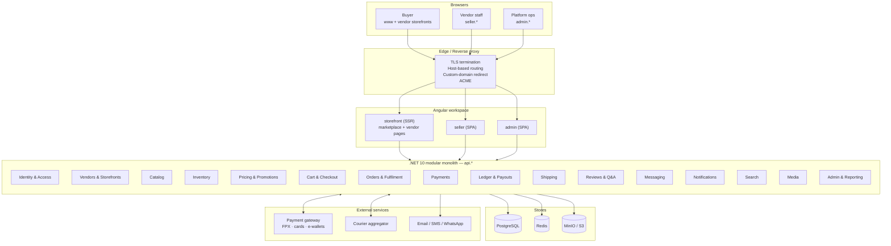

# Lifestyle Marketplace — Master Project Plan

| Field | Value |
|---|---|
| Project code name | **Lifestyle** |
| Document | 00 — Master Project Plan (entry point) |
| Version | 0.1 (Draft) |
| Date | 2026-08-23 |
| Owner | Product / Engineering |
| Status | Draft — pending stakeholder review |
| Related docs | [01 — Business Requirements (BRD)](01-BRD.md) · [02 — Technical FRD](02-TECHNICAL-FRD.md) |

---

## 1. What we are building

A **multi-category, multi-vendor e-commerce marketplace for Malaysia**, modelled on the Shopee
experience: buyers browse one marketplace, but products are sold and fulfilled by many independent
vendors. Each vendor gets their own back-office and their own **public storefront on a subdomain**
(`xyz.lifestyle.com`), with the option to point a **custom domain** (`xyz.com`) at it.

Launch categories:

1. Ladies' dresses
2. Ladies' bags
3. Shoes (ladies + men)
4. Mobile accessories

The category taxonomy is data-driven, so adding categories later is configuration, not code.

### 1.1 Five product surfaces

| # | Surface | Host | Audience | Rendering |
|---|---|---|---|---|
| 1 | **Marketplace** (buyer) | `www.{platform}.com` | Shoppers | Angular SSR (SEO-critical) |
| 2 | **Vendor storefront** (public) | `{slug}.{platform}.com` + custom domain | Shoppers, vendor's own audience | Angular SSR (SEO-critical) |
| 3 | **Vendor Admin** | `seller.{platform}.com` | Vendor owner + staff | Angular SPA |
| 4 | **Super Admin** | `admin.{platform}.com` | Platform ops, finance, CS, content | Angular SPA |
| 5 | **API** | `api.{platform}.com` | All of the above + future mobile app | .NET 10 Web API |

> Surfaces 1 and 2 share most components — a vendor storefront is a themed, vendor-scoped view of
> the same catalog. Building them as one SSR app with tenant-aware theming avoids duplicating the
> product detail page, cart and checkout.

---

## 2. Guiding principles

1. **Modular monolith first.** One deployable .NET API split into strict modules with enforced
   boundaries. Microservices are a scaling answer to a problem we do not have yet; a premature split
   would cost months. Modules are designed so any one can be extracted later.
2. **Money is a ledger, not a column.** Every cent that moves — order payment, commission, shipping
   subsidy, refund, payout — is a double-entry ledger line. No mutable `balance` field as the source
   of truth. This is the single most expensive thing to retrofit.
3. **Multi-vendor is a first-class concept, not a filter.** A cart, an order and a shipment are all
   *split by vendor* from day one. Retrofitting vendor-splitting into a single-seller order model is
   a rewrite.
4. **Data-driven catalog.** Categories, attributes and variant options are records, not enums.
   Merchandising should never require a deployment.
5. **SEO is a hard requirement, not a nice-to-have.** Vendor storefronts exist so vendors can be
   found. SSR, canonical URLs, structured data and sitemaps are in the MVP, not a later phase.
6. **Malaysia-specific from the start.** MYR, SST, FPX + e-wallets, West/East Malaysia shipping
   zones, PDPA, EN/BM language. These are not "localisation later" — they change the data model.
7. **Idempotency everywhere money or stock is touched.** Payment webhooks, order placement, stock
   reservation, payout runs.

---

## 3. Technology stack

| Layer | Choice | Notes |
|---|---|---|
| Backend | **.NET 10 (LTS)**, ASP.NET Core Web API, C# 14 | Minimal APIs + endpoint groups per module |
| ORM | **EF Core 10, code-first** | Migrations checked into repo; one `DbContext` per module, one physical DB |
| Database | **PostgreSQL 17+** | Primary store. `citext`, `pg_trgm`, `unaccent`, `pgcrypto`, JSONB |
| Cache / locks | **Redis 7+** | Cache, distributed lock, rate-limit counters, refresh-token revocation list |
| Background jobs | **Hangfire** (Postgres storage) | Payouts, email, sitemap regen, stock reconciliation, scheduled promos |
| Search (MVP) | **PostgreSQL FTS + `pg_trgm`** | Upgrade path to OpenSearch/Meilisearch when catalog > ~200k SKUs |
| Object storage | **S3-compatible (MinIO, self-hosted)** | Product media, invoices, vendor documents |
| Frontend | **Angular 20+** (single workspace, 3 apps + shared libs) | SSR for surfaces 1 & 2 |
| Styling | **Tailwind CSS + a small in-house component library** | Vendor theming via CSS custom properties |
| Auth | ASP.NET Core Identity + **JWT access / rotating refresh tokens** | Separate token audiences per surface; TOTP 2FA for admins |
| API contract | OpenAPI 3.1 → generated Angular clients | The contract is the integration boundary |
| Observability | Serilog + **OpenTelemetry** (traces/metrics/logs) | Backend TBD with infra |
| Testing | xUnit + **Testcontainers**, Playwright, k6 | Real Postgres in integration tests |
| Containerisation | Docker + Docker Compose (dev), **infra TBD** | Deployment target pending your server details |

**Explicitly deferred until you share infrastructure details:** hosting topology, reverse proxy
choice, CI/CD runner, backup strategy, TLS termination, log/metrics backend, CDN. Section 9 lists
exactly what we will need from you.

---

## 4. Domain, subdomain and custom-domain strategy

### 4.1 Root domain — open decision, blocking

The platform domain is not yet purchased. It follows the pattern `{something}lifestyle.com`.
Everything below uses `{platform}` as the placeholder. Candidate shortlist to check for
availability (and for the `.my` / `.com.my` equivalents, plus matching social handles):

`shoplifestyle.com` · `mylifestyle.com` · `thelifestyle.com` · `golifestyle.com` ·
`kitalifestyle.com` · `yourlifestyle.com` · `nextlifestyle.com` · `dailylifestyle.com`

Selection criteria: short, unambiguous when spoken over the phone, `.com` + `.com.my` both
available, no trademark conflict in Malaysia, and still works as a brand once we sell more than
fashion.

> **Action:** decide and register before Sprint 2. A **wildcard certificate
> (`*.{platform}.com`)** is required for vendor subdomains — this constrains DNS provider choice
> (it must support DNS-01 ACME challenges via API).

### 4.2 Host map

```
www.{platform}.com          → Marketplace (buyer)
{slug}.{platform}.com       → Vendor storefront
seller.{platform}.com       → Vendor Admin
admin.{platform}.com        → Super Admin
api.{platform}.com          → REST API
cdn.{platform}.com          → Static assets + product media
```

Reserved slugs, never assignable to a vendor: `www, api, admin, seller, cdn, img, static, assets,
mail, smtp, ftp, blog, help, support, status, docs, app, m, mobile, dev, staging, test, secure,
pay, checkout, account, my, shop, store, go, link, edge, ns1, ns2, _acme-challenge`.

### 4.3 Custom domain flow (as requested: `xyz.com` → `xyz.{platform}.com`)

1. Vendor enters `xyz.com` in Vendor Admin.
2. Platform issues a verification token; the vendor adds
   `TXT _{platform}-verify.xyz.com = <token>`.
3. Vendor points DNS at our edge: `CNAME www.xyz.com → edge.{platform}.com`, and for the apex
   `xyz.com` an `ALIAS`/`ANAME` record (or an A record to our edge IP if their DNS provider lacks
   ALIAS support).
4. Platform verifies the TXT record and provisions a TLS certificate for `xyz.com` via ACME HTTP-01.
5. Once active, requests to `https://xyz.com/*` return **301** to `https://xyz.{platform}.com/*`,
   preserving path and query string.

> **SEO trade-off worth an explicit decision.** A 301 from the custom domain to the subdomain means
> all search authority accrues to `xyz.{platform}.com` — which benefits the *platform*. Many vendors
> who buy a custom domain expect the opposite: their own domain as the canonical, brand-visible host.
>
> We will build the redirect exactly as you specified, but the design makes the direction a
> **per-vendor `CanonicalHost` setting** with two modes:
> - `Platform` (default, what you described) — the custom domain 301s to the subdomain.
> - `Custom` — the subdomain 301s to the custom domain, and `<link rel="canonical">` points there.
>
> It is one config flag, so it costs nothing now and avoids a painful migration if vendors push
> back. Mechanics in the Technical FRD §5.

---

## 5. Architecture at a glance



### 5.1 Repository layout

```
/
├── docs/                                   # BRD, FRD, ADRs
├── src/
│   ├── api/
│   │   ├── Lifestyle.Api/                  # Host: DI, middleware, endpoint mapping
│   │   ├── Lifestyle.SharedKernel/         # Money, Result, DomainEvent, base entities
│   │   ├── Lifestyle.Infrastructure/       # EF, Redis, storage, outbox, jobs
│   │   └── Modules/
│   │       ├── Lifestyle.Modules.Identity/
│   │       ├── Lifestyle.Modules.Vendors/
│   │       ├── Lifestyle.Modules.Catalog/
│   │       ├── Lifestyle.Modules.Inventory/
│   │       ├── Lifestyle.Modules.Promotions/
│   │       ├── Lifestyle.Modules.Ordering/
│   │       ├── Lifestyle.Modules.Payments/
│   │       ├── Lifestyle.Modules.Ledger/
│   │       ├── Lifestyle.Modules.Shipping/
│   │       ├── Lifestyle.Modules.Reviews/
│   │       ├── Lifestyle.Modules.Messaging/
│   │       ├── Lifestyle.Modules.Notifications/
│   │       ├── Lifestyle.Modules.Search/
│   │       └── Lifestyle.Modules.Media/
│   └── web/                                # Angular workspace
│       ├── apps/storefront/                # SSR — marketplace + vendor storefronts
│       ├── apps/seller/
│       ├── apps/admin/
│       └── libs/{ui,data-access,auth,i18n,util}/
├── tests/{unit,integration,e2e,load}/
├── deploy/                                 # Compose, Dockerfiles, IaC — pending infra input
└── tools/                                  # Seeders, importers, codegen
```

Module boundaries are enforced in CI with an architecture test (NetArchTest): a module may reference
`SharedKernel` and other modules' **`Contracts`** projects only — never their internals.

---

## 6. Delivery roadmap

Sprints are 2 weeks. Durations assume the team in §7; scale proportionally if it is smaller.

### 6.1 Staged and deferred workstreams

Some modules are built in stages: a minimum viable version early because something downstream cannot
function without it, then the full version later. **Shipping & Delivery is the main one.**

| | **Stage 1 — Manual** (Phases 3–4, pre-launch) | **Stage 2 — Integrated** (Phase 6, post-launch) |
|---|---|---|
| Rates | Vendor-configured flat or weight-tier rates per zone, maintained in Vendor Admin | Live rates from a courier aggregator API |
| Booking | Vendor books with their courier off-platform, as they do today | Pickup booked from Vendor Admin |
| Label | Vendor uses the courier's own system | AWB generated and printed in-app |
| Tracking | Vendor pastes courier name + tracking number; buyer gets a deep link to the courier's site | Automatic tracking events via webhook |
| Delivery confirmation | Buyer confirms receipt, or a time-based fallback fires | Courier-confirmed delivery event |

**Why this split is safe.** Checkout cannot exist without *a* shipping cost, so rate calculation must
be in Phase 3 — but it does not have to come from a carrier API. Most of our target vendors (BRD §5.2,
persona P2) already arrange their own courier pickups and have their own rate cards; Stage 1 matches
how they work today rather than forcing a new workflow at launch.

**The one real consequence, and how it is handled.** Escrow release is triggered by delivery
(BRD §9.2). Without courier webhooks there is no automatic "delivered" signal, so in Stage 1 the
sub-order reaches `Delivered` when the **buyer confirms receipt**, with a fallback that auto-completes
`N` days after the vendor marked it shipped (default 10, configurable). That fallback window is
deliberately longer than the 5-day post-delivery window used in Stage 2, because we are measuring from
dispatch rather than arrival. Vendors are paid slightly later under Stage 1 — a known, accepted
trade-off, and it reverses automatically once Stage 2 lands. Technical detail in FRD §14 and §11.3.

**Everything in Stage 2 is designed now, not later.** The `IShippingProvider` interface, the
`shipments` and `shipment_tracking_events` tables, the zone model and the parcel dimension fields are
all built in Phase 3 (FRD §14). Stage 1 ships a `ManualShippingProvider` implementation against that
same interface. Stage 2 is then a second implementation plus UI — not a redesign.

### 6.2 v1 sells through WhatsApp, not through checkout

**The v1 launch has no cart, no checkout, no payment gateway and no ledger.** A buyer browses the
storefront, taps **Order on WhatsApp** (or Messenger), and lands in a chat with the shop owner with a
pre-filled message naming the product, variant, price and a reference code. The sale is closed in
chat, exactly as these sellers already work today. The vendor then marks the stock down in Vendor
Admin.

**Why this is the right MVP, not a compromise.** It removes the three slowest and riskiest things
from the launch path at once: payment gateway merchant approval (someone else's 4–8 week process),
the checkout and escrow machinery, and the double-entry ledger. It also matches how commerce already
works in Bangladesh — buyers expect to negotiate, ask for photos, and confirm on WhatsApp. Forcing a
Western-style checkout on that audience at launch would be the actual compromise.

What we still build in full: the catalogue, the variant model, the storefronts, search, the vendor
back office, and the media pipeline. **Nothing built for v1 is thrown away** — Phase 4 adds checkout
alongside conversational ordering rather than replacing it.

#### What this changes

| Area | Consequence |
|---|---|
| **Revenue** | **Commission is not collectable in v1.** We cannot see or verify an order that happens in WhatsApp. v1 revenue must be a **subscription or setup fee per shop**. This is a business-model change, not a detail — see BRD §4 |
| **Stock accuracy** | The single biggest operational risk (R13). Sellers forget to decrement. Mitigated with one-tap updates, staleness indicators and reminders — but v1 stock is *advisory*, and the UI should say so |
| **Analytics** | We see inquiries, not sales. Conversion is vendor-self-reported. Plan for imperfect numbers |
| **Buyer accounts** | Optional in v1 — browsing and ordering need no login. This dramatically reduces the personal data we hold, which matters for Italy (doc 03 §15) |
| **Shipping** | No shipping engine at all in v1; the vendor states their terms in text and settles it in chat. Shipping Stage 1 arrives with checkout in Phase 4 |
| **Positioning** | v1 is closer to "hosted shop with a catalogue" than "marketplace". That matches the stated model — the site should look like the shop owner's own website |

#### Migration into Phase 4

Conversational ordering is **not** switched off when checkout arrives. Both run side by side, toggled
per vendor, because some sellers and some categories will keep converting better in chat. The order
inquiry record built in Phase 3 is deliberately shaped like a thin order, so a vendor moving to
checkout sees continuous history rather than a hard break.

### Phase 0 — Foundations (Sprints 1–2)

- Repo, solution skeleton, module scaffolding, architecture tests
- Docker Compose dev environment (Postgres, Redis, MinIO, Mailpit)
- EF Core base: conventions, audit, soft delete, concurrency tokens, first migration
- Identity: registration, login, refresh rotation, roles, permission model, 2FA for admins
- Angular workspace, three app shells, shared UI kit, auth interceptor, generated API client
- CI: build, test, lint, migration-drift check
- **Domain purchased; wildcard certificate issued**

**Exit:** a user can register, log in on all three surfaces, and see an empty authenticated shell.

### Phase 1 — Catalog & vendor onboarding (Sprints 3–5)

- Category tree, attribute sets, attribute types
- Product / variant (SKU) model, media upload and derivatives, draft → review → publish workflow
- Vendor registration, KYC document upload, super-admin approval queue
- Vendor Admin: product CRUD, bulk CSV import, inventory levels
- Super Admin: category and attribute management, vendor approval, product moderation
- Seed the four launch categories with real attribute sets

**Exit:** an approved vendor can publish a live, correctly-attributed product with variants.

### Phase 2 — Storefront, browse & search (Sprints 6–8)

- Marketplace home, category browse, faceted filtering, sort, pagination
- Product detail page: variant selector, gallery, shipping estimate, vendor card
- **Vendor storefront**: subdomain resolution, themed layout, banner/logo/about, vendor-scoped
  product listing and search
- SSR, meta tags, JSON-LD (`Product`, `Offer`, `AggregateRating`, `BreadcrumbList`), sitemaps,
  per-host robots policy
- Wishlist, recently viewed, follow-vendor

**Exit:** the storefront is publicly crawlable and a shopper can find a product three different ways.

### Phase 3 — Conversational ordering & **v1 launch** (Sprints 9–11)

The catalogue goes live and starts taking real orders — **through WhatsApp and Messenger, not through
a checkout**. See §6.2 for the model and its consequences.

- "Order on WhatsApp" / "Order on Messenger" on product and storefront pages
- Pre-filled message templates carrying product, variant, SKU, price, quantity, URL and a reference code
- Per-vendor contact configuration (WhatsApp number, Messenger page, business hours, auto-reply text)
- **Order inquiry log** — the click is recorded on-platform even though the conversation is not
- Vendor Admin: inquiry list, mark as won/lost, **one-tap stock decrement** from an inquiry
- Manual stock management with staleness warnings and daily reminders
- Vendor-authored shipping and payment policy text on the storefront (no shipping engine yet)
- Basic analytics: inquiries per product, per storefront, conversion self-reported by the vendor
- Legal, policies, help content for v1; PDPA/consent basics
- Performance pass, security review, pilot cohort onboarding

**Exit:** a buyer finds a product, taps through to WhatsApp with a correctly filled message, the
vendor sells it, and stock is decremented in two taps.

### Phase 4 — Cart, checkout, payments, ledger (Sprints 12–16) — *the critical path*

- Multi-vendor cart, stock reservation with TTL
- **Shipping Stage 1 (manual rates)** — vendor-configured flat/weight rates per zone, free-shipping
  thresholds. No carrier API (see §6.1)
- Checkout: addresses, per-vendor shipping choice, voucher application, order summary
- Payment gateway integration, webhook handling, idempotency. **COD where the market needs it**
- Order split into vendor sub-orders; order state machine; buyer and vendor order views
- **Double-entry ledger**: capture, commission, escrow hold, release
- Invoices and receipts; order notification emails
- Migration path: inquiry-based selling and checkout run **side by side**, per vendor (§6.2)

**Exit:** a real end-to-end purchase from two vendors in one cart, with correct money movement.

### Phase 5 — Fulfilment, promotions, trust (Sprints 17–20)

- **Shipping Stage 1 fulfilment** — vendor marks as shipped and enters courier + tracking number
  manually; buyer sees a deep link to the courier's own tracking page. No AWB generation, no pickup
  booking, no automated tracking (see §6.1)
- Cancellations, returns, refunds (full and partial), dispute handling
- Promotions engine: vouchers (platform- and vendor-funded), flash sales, bundles, free shipping,
  category campaigns, stacking rules
- Reviews and ratings with purchase verification; vendor Q&A
- Buyer ↔ vendor chat
- Vendor payout runs, statements, settlement reports

**Exit:** the full order lifecycle including the unhappy paths.

### Phase 6 — **v2 launch readiness** — full marketplace (Sprints 21–22)

- Super Admin reporting: GMV, commission, vendor performance, category performance
- Vendor Admin analytics: sales, traffic, conversion, top SKUs
- **Custom domain provisioning** (verification, certificate automation, redirect)
- SST handling and e-invoice readiness (BRD §12)
- PDPA: consent, data export, deletion-request workflow
- Performance tuning, load test to target, security review, penetration test
- Content: help centre, policies, T&Cs, vendor agreement
- Soft launch with a pilot cohort of 10–20 vendors

**Exit:** full marketplace launch.

### Phase 7 — Shipping & Delivery integration (Sprints 23–25) — *deferred, in the pipeline*

This is a **committed, scheduled workstream**, not backlog. It is sequenced last because Stage 1
(manual rates + manual tracking entry) is enough to transact, and because courier contracts and
volume-based rate negotiation land better once we have real order volume to quote. The architecture
reserves the seam for it from Phase 4 — see §6.1.

- Courier aggregator integration behind `IShippingProvider` (EasyParcel or equivalent)
- Live rate quoting at checkout, replacing manual rate tables (vendors may keep manual rates)
- Airway bill / label generation and printing from Vendor Admin
- Pickup request booking and scheduling
- Automated tracking via webhooks, with a polling fallback
- **Automated delivery confirmation** — closes the gap described in §6.1
- Volumetric weight calculation, parcel dimension validation
- Shipping cost reconciliation: quoted vs actually charged by the courier
- Optional: direct courier integrations for better rates at volume

**Exit:** a vendor books a pickup, prints a label and never touches a tracking number by hand; escrow
release is driven by courier-confirmed delivery.

### Post-launch backlog (not scheduled)

Mobile app (the API is already the contract) · live selling · affiliate programme · loyalty coins ·
paid vendor subscription tiers · promoted listings / ads · multi-warehouse · cross-border ·
full BM and Chinese localisation · AI product-description assist · recommendation engine.

### Timeline summary

| Phase | Sprints | Cumulative weeks |
|---|---|---|
| 0 — Foundations | 1–2 | 4 |
| 1 — Catalog & vendors | 3–5 | 10 |
| 2 — Storefronts & discovery | 6–8 | 16 |
| 3 — Conversational ordering | 9–11 | 22 |
| **▶ v1 LAUNCH — live, selling via WhatsApp** | | **22** |
| 4 — Checkout, payments, ledger | 12–16 | 32 |
| 5 — Fulfilment & promotions | 17–20 | 40 |
| 6 — v2 launch readiness | 21–22 | 44 |
| **▶ v2 LAUNCH — full marketplace** | | **44** |
| 7 — Shipping & Delivery integration | 23–25 | 50 |

**The headline change: v1 goes live at ~22 weeks (about 5 months) instead of 38.** Selling through
WhatsApp removes checkout, payments, the ledger and gateway approval from the launch critical path —
roughly four months earlier to real orders, real vendors and real feedback. Full marketplace
capability lands at ~44 weeks, only slightly later than the original single-launch plan, and by then
it is being built against a live catalogue with known vendors instead of assumptions.

**This also defuses the biggest schedule risk.** Payment gateway merchant approval (4–8 weeks of
someone else's process, risk R1) no longer blocks launch — it blocks Phase 4, with months of slack in
front of it. Courier setup was already off the critical path via Phase 7.

---

## 7. Team and workstreams

| Role | Count | Focus |
|---|---|---|
| Tech lead / architect | 1 | Boundaries, ledger, checkout, code review |
| Backend (.NET) | 2 | Modules, integrations, jobs |
| Frontend (Angular) | 2 | Storefront SSR, seller and admin panels |
| QA | 1 (from Phase 2) | Test plan, automation, UAT |
| Product / BA | 1 | BRD ownership, acceptance criteria, vendor pilot |
| UI/UX designer | 1 (heavy in Phases 0–3) | Design system, storefront, checkout flows |
| DevOps | 0.5 | Infra, CI/CD, monitoring — ramps up once infra is defined |

Minimum viable team: 1 lead + 1 backend + 1 frontend + 1 product, at roughly double the timeline.

---

## 8. Environments, branching, quality gates

**Environments:** `local` (Compose) → `dev` (auto-deploy from `develop`) → `staging` (production
mirror, UAT, gateway sandbox) → `production`.

**Branching:** trunk-based with short-lived feature branches off `develop`; release branches cut from
`develop`; hotfixes off `master`. Conventional commits, squash merge.

**Definition of Done** — a story is done when acceptance criteria pass; unit and integration tests are
written and green; the API is documented in OpenAPI; the migration is included and reversible;
permission checks are enforced server-side; the action is audit-logged if it mutates money, stock or
vendor state; the UI is responsive down to 360 px; no new critical or high SAST finding; and the PR
was reviewed by someone other than the author.

**Merge gates:** build · unit + integration tests · lint/format · EF migration-drift check ·
architecture boundary tests · dependency vulnerability scan · frontend bundle-size budget.

---

## 9. Open decisions we need from you

Ordered by how soon they block work.

| # | Decision | Blocks | Needed by |
|---|---|---|---|
| 1 | **Platform domain name** — pick and register | Certificates, all host config, branding | Sprint 2 |
| 2 | **Server / infrastructure details** — specs, OS, existing stack, who administers it, backup capability | Deployment design, CI/CD, Phase 0 exit | Sprint 2 |
| 3 | **Business entity and bank account** (Sdn Bhd? SSM registration) | Payment gateway merchant application | Sprint 2 |
| 3b | **v1 pricing — what do shops pay for a storefront?** Commission is not collectable in v1 (§6.2), so this is v1's only revenue | Business model, vendor agreement, v1 launch | **Sprint 6** |
| 3c | **WhatsApp approach** — click-to-chat links only, or the WhatsApp Business Cloud API? (FRD §18.3.7) | Phase 3 scope; Cloud API needs Meta business verification | Sprint 7 |
| 4 | **Payment gateway** — options and trade-offs in BRD §11 | Phase 4; long approval lead time, so apply during Phase 2 | Sprint 8 |
| 5 | **Commission model** — flat or per-category, and the actual numbers. Applies from Phase 4 | Ledger design, vendor agreement | Sprint 12 |
| 6 | **Settlement terms** — escrow release trigger, payout cadence, minimum payout | Ledger and payout module | Sprint 8 |
| 7 | **Who bears shipping cost** — buyer, vendor, or subsidised | Phase 3 rate setup | Sprint 10 |
| 7b | **Courier strategy** — aggregator vs direct contracts | Phase 6 only; deferred with the module (§6.1) | Sprint 16 |
| 8 | **Custom-domain canonical direction** — platform-canonical (as described) vs vendor-canonical (§4.3) | Phase 5 | Sprint 12 |
| 9 | **Is a custom domain a paid tier?** Which vendors qualify | Vendor plan model | Sprint 12 |
| 10 | **Languages at launch** — EN only, or EN + BM | i18n scope, content budget | Sprint 6 |
| 11 | **SST registration status and e-invoice obligations** — confirm with a Malaysian tax advisor | Price display, invoicing | Sprint 12 |
| 12 | **Brand identity** — logo, palette, typography | Design system | Sprint 3 |

---

## 10. Risks

| # | Risk | Impact | Likelihood | Mitigation |
|---|---|---|---|---|
| R1 | Payment gateway merchant approval delays | Blocks Phase 4 exit — **no longer blocks launch** (§6.2) | Medium | Apply during Phase 2; build against sandbox; keep the gateway behind an abstraction so a second provider is a one-sprint swap. Selling via WhatsApp in v1 gives months of slack in front of this |
| R2 | Vendor acquisition falls short — a marketplace with no sellers has no buyers | Existential | High | Recruit the pilot cohort during Phase 2; manual white-glove onboarding; CSV/marketplace import tooling; zero commission for the first N months |
| R3 | Checkout and ledger complexity underestimated | 4–6 week slip | Medium | Most senior people on Phase 3; ledger designed and reviewed before coding; property-based tests on money arithmetic |
| R4 | Custom-domain TLS automation (issuance and renewal at scale) | Vendor-visible outages | Medium | Proven on-demand-TLS edge; renewal monitoring with alerts; manual fallback runbook |
| R5 | Competing with Shopee/Lazada on price and delivery speed | Growth | High | Business-side: niche curation, vendor branding (the storefront is the differentiator), community. Not a technical fix — needs a positioning decision |
| R6 | Counterfeit or prohibited listings damaging trust | Reputational, legal | Medium | Moderation queue, keyword and image screening, vendor KYC, takedown SLA, strike policy |
| R7 | Scope creep from "Shopee has it" | Timeline | High | MVP scope frozen in BRD §6; anything else goes to the post-launch backlog with an explicit trade decision |
| R8 | Search quality on Postgres FTS at scale | Conversion | Medium | Search behind an interface from day one; measure zero-result rate; OpenSearch swap pre-planned |
| R9 | PDPA / e-invoice compliance gaps | Legal, fines | Medium | Engage Malaysian legal and tax advisors before launch; consent and audit built in Phase 5 |
| R10 | Single-server deployment as a single point of failure | Outage | Medium | Resolve during infra planning; at minimum, automated off-site backups plus a documented restore drill |
| R13 | **Stock drift in v1** — sellers forget to decrement after a WhatsApp sale, so buyers order sold-out items | Buyer trust, vendor support load | **High** | One-tap decrement from the inquiry list; "stock last updated N days ago" badge on the vendor dashboard; daily reminder for shops with open inquiries; show stock as availability bands ("In stock" / "Low") rather than exact counts, so small drift is not a visible lie |
| R14 | **No commission revenue in v1** — orders close off-platform and cannot be verified | Business model | Certain, by design | Subscription/setup fee per shop for v1 (§6.2); commission starts with Phase 4 checkout. Decide pricing before v1 launch, not after |
| R15 | Vendors stay on WhatsApp and never adopt checkout, so commission never starts | Revenue | Medium | Do not force migration; make checkout obviously better (vouchers, buyer trust, tracked orders). Price the subscription so it stays viable if some vendors never convert |
| R11 | Manual shipping (Stage 1) creates support load — vendors mistype tracking numbers, forget to mark shipped, quote rates that lose them money | Ops cost, buyer trust | Medium-High | Tracking number format validation per courier; "not yet shipped" nudges at 24 h and 48 h; a rate calculator in Vendor Admin showing real courier rates for reference; measure the ticket rate — if it exceeds ~3 per 100 orders, pull Phase 6 forward |
| R12 | Deferred shipping delays escrow release, hurting vendor cash flow (§6.1) | Vendor satisfaction | Medium | Communicate the dispatch-based window in the vendor agreement up front; consider a shorter fallback for vendors with a good track record; Phase 6 removes it |

---

## 11. Success criteria (12 months post-launch)

| Metric | Target |
|---|---|
| Active vendors (≥ 1 sale/month) | 300 |
| Live SKUs | 30,000 |
| Monthly GMV | RM 1.5M |
| Buyer conversion rate | ≥ 1.8% |
| Repeat purchase rate (90-day) | ≥ 25% |
| Fulfilment SLA (shipped within 2 business days) | ≥ 92% |
| Vendor storefronts on custom domains | 50 |
| API p95 latency | < 400 ms |
| Uptime | ≥ 99.5% |

These are placeholders for the business to confirm — they drive capacity planning, not just
reporting.

---

## 12. Document map

| Doc | Contents | Primary audience |
|---|---|---|
| **00 — Master Project Plan** (this document) | Scope, stack, roadmap, risks, decisions | Everyone |
| [**01 — BRD**](01-BRD.md) | Business model, personas, capabilities, policies, rules | Business, product, vendors |
| [**02 — Technical FRD**](02-TECHNICAL-FRD.md) | Architecture, data model, APIs, flows, NFRs | Engineering, QA |
| [**03 — Infrastructure & Multi-Region**](03-INFRASTRUCTURE-MULTI-REGION.md) | Existing server baseline, MY/BD/IT deployment strategy, the Italy answer, capacity, gaps | DevOps, business |
| [`infrastructure-mypropertymart/`](infrastructure-mypropertymart/) | Existing PropertyMart infrastructure — the baseline doc 03 builds on | DevOps |
| 04 — UI/UX Design System | *To follow* | Design, frontend |
| 05 — ADR log | Architecture decisions with rationale | Engineering |
