# Technical Functional Requirements Document (FRD)
## Lifestyle — Multi-Vendor Marketplace

| Field | Value |
|---|---|
| Document | 02 — Technical FRD |
| Version | 0.1 (Draft) |
| Date | 2026-08-23 |
| Status | Draft — pending engineering review |
| Stack | .NET 10 · EF Core 10 (code-first) · PostgreSQL 17+ · Angular 20+ |
| Related | [00 — Master Project Plan](00-PROJECT-PLAN.md) · [01 — BRD](01-BRD.md) |

> Business rule IDs referenced as `BR-x-nn` are defined in the BRD.

---

## Table of contents

1. [Architecture](#1-architecture)
2. [Solution structure](#2-solution-structure)
3. [Cross-cutting conventions](#3-cross-cutting-conventions)
4. [Identity, authentication, authorisation](#4-identity-authentication-authorisation)
5. [Multi-tenancy, hosts and custom domains](#5-multi-tenancy-hosts-and-custom-domains)
6. [Data model](#6-data-model)
7. [Catalog and the attribute system](#7-catalog-and-the-attribute-system)
8. [Inventory](#8-inventory)
9. [Pricing and promotions engine](#9-pricing-and-promotions-engine)
10. [Cart and checkout](#10-cart-and-checkout)
11. [Orders and the state machine](#11-orders-and-the-state-machine)
12. [Payments](#12-payments)
13. [Ledger, wallet and payouts](#13-ledger-wallet-and-payouts)
14. [Shipping](#14-shipping)
15. [Returns, refunds, disputes](#15-returns-refunds-disputes)
16. [Search](#16-search)
17. [Media](#17-media)
18. [Notifications and messaging](#18-notifications-and-messaging)
19. [API design](#19-api-design)
20. [Frontend architecture](#20-frontend-architecture)
21. [Background jobs and the outbox](#21-background-jobs-and-the-outbox)
22. [Caching](#22-caching)
23. [Observability](#23-observability)
24. [Security](#24-security)
25. [Non-functional requirements](#25-non-functional-requirements)
26. [Testing](#26-testing)
27. [Build, deploy, environments](#27-build-deploy-environments)
28. [Appendices](#28-appendices)

---

## 1. Architecture

### 1.1 Style

A **modular monolith**: a single deployable ASP.NET Core application partitioned into modules with
enforced compile-time boundaries. Each module owns its tables, its domain logic and its endpoints,
and exposes a `Contracts` project that is the only thing other modules may reference.

Rationale: at our scale a distributed system would add operational cost and failure modes without
buying anything. The boundaries are what matter, and they can be enforced in a monolith. If a module
later needs independent scaling (Search and Media are the likely first candidates), it can be
extracted without rewriting its consumers, because they only ever touched its contracts.

### 1.2 Module map and dependencies

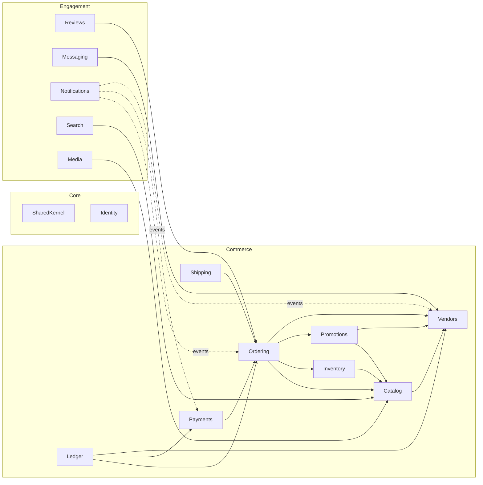

Solid arrows are synchronous contract calls. Dotted arrows are asynchronous domain events via the
outbox — Notifications never blocks a transaction.

### 1.3 Layering inside a module

```
Lifestyle.Modules.{Name}/
├── Contracts/          # public: DTOs, integration events, module interface. Referenced by others
├── Domain/             # entities, value objects, domain events, invariants. No EF attributes
├── Application/        # use-case handlers, validators, mapping, module interface implementation
├── Infrastructure/     # EF configurations, repositories, external clients, migrations
└── Endpoints/          # minimal API endpoint definitions, request/response models
```

Dependencies point inward: `Endpoints → Application → Domain`, with `Infrastructure` implementing
interfaces defined in `Application`/`Domain`.

### 1.4 Request pipeline

```
Kestrel
 → Exception handler (→ ProblemDetails)
 → Request logging + correlation ID
 → CORS
 → Host/tenant resolution        (§5.2)
 → Authentication (JWT)
 → Rate limiting                 (§24.6)
 → Authorisation (permissions)   (§4.4)
 → Idempotency filter            (§19.6, mutating endpoints only)
 → Endpoint handler → Application handler → Domain
 → Transaction + outbox commit   (§21.1)
```

---

## 2. Solution structure

| Project | Purpose |
|---|---|
| `Lifestyle.Api` | Host. Composition root, middleware, module registration, OpenAPI, health checks |
| `Lifestyle.SharedKernel` | `Entity`, `AggregateRoot`, `ValueObject`, `Money`, `Result<T>`, `IDomainEvent`, `IClock`, `ICurrentUser`, `ITenantContext`, common enums |
| `Lifestyle.Infrastructure` | `AppDbContext` composition, EF conventions, outbox, Redis, storage, Hangfire wiring, email/SMS clients |
| `Lifestyle.Modules.*` | The 14 business modules (§1.2) |
| `Lifestyle.Migrator` | Standalone migration runner used at deploy time |
| `Lifestyle.Tests.*` | Unit, integration, architecture tests |

### 2.1 One database, schema per module

A single PostgreSQL database, with one **schema** per module: `identity`, `vendors`, `catalog`,
`inventory`, `promotions`, `ordering`, `payments`, `ledger`, `shipping`, `reviews`, `messaging`,
`notifications`, `search`, `media`, `platform`.

Cross-schema **foreign keys are not used**. A module references another module's aggregate by ID
only, and validates through that module's contract interface. This keeps the extraction path open.
The exception is `identity.users`, referenced by ID everywhere but never joined across in queries.

Each module has its own `DbContext` with its own migration history table
(`__ef_migrations_{module}`), so migrations can be developed and applied independently.

```csharp
// Example: Catalog module context
public sealed class CatalogDbContext(DbContextOptions<CatalogDbContext> options) : DbContext(options)
{
    protected override void OnModelCreating(ModelBuilder b)
    {
        b.HasDefaultSchema("catalog");
        b.ApplyConfigurationsFromAssembly(typeof(CatalogDbContext).Assembly);
    }
}
```

Because all contexts share one connection string and database, a single `TransactionScope`-free
ambient transaction over a shared `DbConnection` is used where a use case must span modules
(checkout is the main one — §10.4).

---

## 3. Cross-cutting conventions

### 3.1 EF Core conventions (code-first)

| Concern | Convention |
|---|---|
| Naming | `snake_case` for tables and columns, applied by a global naming convention (EFCore.NamingConventions) |
| Primary keys | `Guid` v7 (time-ordered) generated in application code, not by the database — avoids index fragmentation while keeping IDs opaque and safe to expose |
| Money | Owned value object `Money { decimal Amount, string Currency }` mapped to `numeric(18,4)` + `char(3)`. **Never `float`/`double`** |
| Timestamps | `timestamptz`, always UTC in the database; converted at the edge for display (MYT = UTC+8) |
| Enums | Stored as `int` with an explicit value, or as a `text` check constraint for values also read by analysts |
| Concurrency | `uint xmin` mapped as a concurrency token on aggregates that can be edited concurrently (products, inventory, wallet) |
| Soft delete | `deleted_at timestamptz null` + a global query filter, on entities that must not vanish from history (products, vendors, reviews). Orders and ledger entries are **never** deleted |
| Audit | `created_at`, `created_by`, `updated_at`, `updated_by` via a `SaveChanges` interceptor |
| JSON | `jsonb` for genuinely schemaless data (attribute values, gateway payloads, event data). Never for anything queried by a filter that needs an index... unless GIN-indexed deliberately |
| Migrations | Generated per module, reviewed as code, always reversible. Destructive changes are split into expand → migrate → contract releases |
| Query defaults | `AsNoTracking()` on all read paths; explicit `Include`; no lazy loading — it is disabled globally |
| Text search | `citext` for emails and slugs; `tsvector` generated columns for search text (§16) |

### 3.2 Result and error handling

Application handlers return `Result<T>` rather than throwing for expected failures. Only genuinely
exceptional conditions throw. The endpoint layer maps `Result` failures to RFC 9457 `ProblemDetails`
with a stable machine-readable `type`.

### 3.3 Domain events

Aggregates raise domain events; they are collected during `SaveChanges` and written to the outbox in
the **same transaction** as the state change (§21.1). Handlers are asynchronous and idempotent.

### 3.4 Time and identity

`IClock` and `ICurrentUser` are injected — never `DateTime.UtcNow` or `HttpContext` directly in
domain or application code. This keeps tests deterministic.

---

## 4. Identity, authentication, authorisation

### 4.1 Account model

One `users` table for all humans. A user has one or more **memberships** that grant them a role in a
context:

- **Platform membership** → a role in the platform (SuperAdmin, OpsAgent, FinanceAgent, ContentEditor)
- **Vendor membership** → a role scoped to a specific vendor (VendorOwner, VendorManager, OrderProcessor, ContentEditor)
- Everyone with no membership is a **Buyer**

This means a single person can be a buyer and also staff at two different vendors, with a vendor
switcher in the seller panel. Modelling this as separate user tables per surface seems simpler at
first and becomes painful the first time it happens — which it will.

### 4.2 Authentication

| Aspect | Decision |
|---|---|
| Framework | ASP.NET Core Identity for password hashing, lockout, token providers |
| Credentials | Email + password, or phone + OTP; social login (Google, Facebook) for buyers |
| Access token | JWT, 15 min lifetime, signed RS256, contains `sub`, `aud`, memberships, and a `perm` claim compacted as a bitmask reference |
| Refresh token | Opaque, 30 days, **rotating** — every use issues a new one and revokes the old; reuse of a revoked token revokes the whole family and alerts |
| Storage (web) | Refresh token in an `HttpOnly; Secure; SameSite=Strict` cookie; access token in memory only. **No tokens in `localStorage`** |
| Audience separation | Distinct `aud` per surface (`buyer`, `seller`, `admin`). A buyer token is rejected by admin endpoints even if the user happens to have the role |
| 2FA | TOTP, **mandatory** for all platform admins and vendor owners; optional for buyers |
| Password policy | Minimum 10 characters, checked against a compromised-password list; no forced rotation |
| Session control | Users can list and revoke active sessions; admin can force-revoke |
| Impersonation | Admins with `vendor.impersonate` mint a short-lived (30 min) token carrying `act` (actor) claims; every action is logged as "X acting as Y" and the UI shows a persistent banner (`BR-A-03`) |

### 4.3 Password reset and verification

Single-use, 30-minute, hashed-at-rest tokens; identical response whether or not the account exists;
rate-limited per email and per IP. Email verification required before a buyer can review, and before
a vendor can be submitted for approval.

### 4.4 Authorisation model

Permission-based, not role-based, at the enforcement point. Roles are named bundles of permissions
and are editable in the admin panel (`BR-A-01`).

Permissions are `resource.action` strings: `product.create`, `product.publish`, `order.refund`,
`vendor.approve`, `payout.execute`, `settings.write`.

```csharp
[RequirePermission(Permissions.Product.Publish)]
public static async Task<IResult> PublishProduct(
    Guid productId, IProductService svc, ITenantContext tenant, CancellationToken ct)
```

Two checks always happen, and both are server-side:

1. **Does this user hold the permission?**
2. **Is the target resource inside their scope?** A `VendorManager` at vendor A holding
   `product.publish` must not publish vendor B's product.

Scope enforcement is implemented as a mandatory `vendor_id` predicate applied in the repository layer
for vendor-scoped aggregates, derived from `ITenantContext` — not left to each handler to remember.
An architecture test asserts that every vendor-scoped repository method goes through the scoped base.

### 4.5 Default roles

| Role | Scope | Key permissions |
|---|---|---|
| `SuperAdmin` | Platform | All |
| `OpsAgent` | Platform | Vendor approval, product moderation, order view, dispute resolution |
| `FinanceAgent` | Platform | Ledger read, payout execute, refund approve, financial reports |
| `ContentEditor` | Platform | Banners, campaigns, categories, CMS pages |
| `SupportAgent` | Platform | Order view, buyer/vendor lookup, impersonation, chat view |
| `VendorOwner` | Vendor | Everything within the vendor, including staff and bank details |
| `VendorManager` | Vendor | Products, orders, promotions, storefront. No bank details, no staff |
| `OrderProcessor` | Vendor | Orders and shipping only |
| `VendorContentEditor` | Vendor | Products and storefront only |

Full matrix in [Appendix B](#appendix-b--permission-matrix).

---

## 5. Multi-tenancy, hosts and custom domains

### 5.1 Tenancy model

**Shared database, shared schema, discriminator column.** Every vendor-owned row carries
`vendor_id`. A separate database or schema per vendor is rejected: thousands of vendors would make
migrations and connection pooling unmanageable, and the marketplace's core query — "search across all
vendors" — becomes a cross-database join.

The *marketplace* surfaces query without a vendor filter. The *storefront* and *seller* surfaces
always apply one.

### 5.2 Host resolution middleware

Runs before authentication and populates `ITenantContext`.

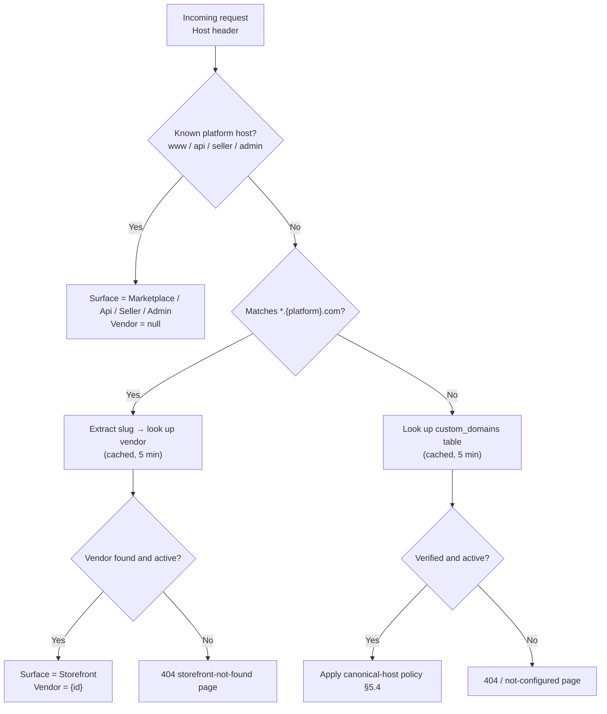

The vendor-by-host lookup is cached in Redis (`host:{hostname}` → vendor id + canonical policy,
5 min TTL, invalidated on slug or domain change). This lookup is on the hot path of every storefront
request, so it must not hit the database each time.

### 5.3 Storefront slug lifecycle

Slug rules per `BR-S`/§10.3 of the BRD. On change, the old slug is written to `vendor_slug_history`
and serves a 301 to the new slug for 12 months, after which it is released back to the pool.

### 5.4 Custom domains

#### Data

```
vendors.custom_domains
  id, vendor_id, hostname (citext, unique), status,
  verification_token, verification_method, verified_at,
  certificate_status, certificate_expires_at,
  is_primary, canonical_policy, last_checked_at, last_error, created_at
```

`status`: `Pending → Verifying → Verified → Active`, plus `Failed`, `Disabled`, `Blocked`.

#### Provisioning sequence

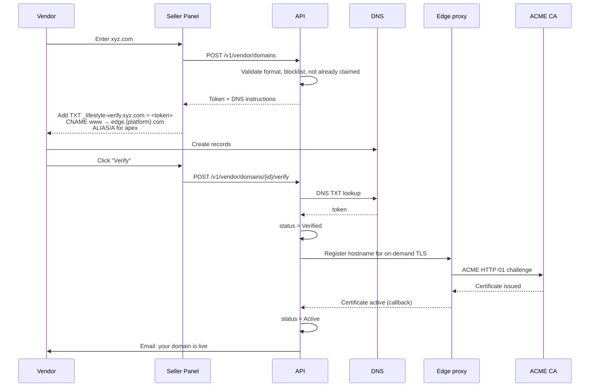

A background job re-checks DNS and certificate expiry daily, sets `Failed` with `last_error` on
problems, and notifies the vendor (`BR-D-06`). Certificates renew automatically at the edge; renewal
failures alert operations.

#### Redirect behaviour

Implemented at the edge where possible (cheapest), with an application fallback so behaviour is
testable and consistent:

| `canonical_policy` | Request to custom domain | Request to subdomain | `<link rel="canonical">` |
|---|---|---|---|
| `Platform` *(default; what was specified)* | **301 →** `https://{slug}.{platform}.com{path}{query}` | Serves the page | Subdomain URL |
| `Custom` | Serves the page | **301 →** `https://{custom}{path}{query}` | Custom domain URL |
| `MarketplaceCanonical` | 301 → subdomain | Serves the page | `www.{platform}.com/p/...` |

Rules that apply regardless of policy:

- Redirects are **301** and preserve path, query string and fragment.
- `http://` always upgrades to `https://` first, then applies the policy — one redirect hop each, and
  never a loop.
- The apex and `www` variants of a custom domain both resolve; the non-primary one 301s to the primary.
- `/sitemap.xml` and `/robots.txt` are served per effective canonical host only; the non-canonical
  host serves `robots.txt` with `Disallow: /` to prevent duplicate indexing.

#### Edge requirements

The reverse proxy must support wildcard TLS for `*.{platform}.com` and **on-demand certificate
issuance** for arbitrary customer hostnames, with an authorisation callback to the API so we only
issue certificates for hostnames we recognise (otherwise it is an open certificate-request relay and
a denial-of-service vector). Caddy handles this natively; Nginx or Traefik plus an ACME companion
also work. Final choice belongs to the infrastructure document.

---

## 6. Data model

### 6.1 Core entity relationships

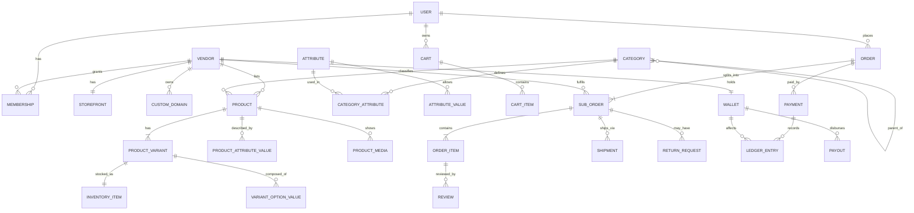

### 6.2 Table inventory by schema

Key columns only; full DDL lives in the migrations.

#### `identity`

| Table | Key columns |
|---|---|
| `users` | id, email (citext, unique), phone, password_hash, email_verified_at, phone_verified_at, status, two_factor_enabled, locked_until, last_login_at |
| `memberships` | id, user_id, scope (`Platform`/`Vendor`), vendor_id (null for platform), role_id, status, invited_by, accepted_at |
| `roles` | id, name, scope, is_system |
| `role_permissions` | role_id, permission (text) |
| `refresh_tokens` | id, user_id, token_hash, family_id, expires_at, revoked_at, replaced_by, ip, user_agent |
| `external_logins` | id, user_id, provider, provider_key |
| `user_addresses` | id, user_id, label, recipient, phone, line1, line2, city, state, postcode, is_default, zone |
| `consents` | id, user_id, document_type, document_version, accepted_at, ip |

#### `vendors`

| Table | Key columns |
|---|---|
| `vendors` | id, legal_name, display_name, slug (citext, unique), business_type, registration_no, status, tier, commission_override_pct, approved_at, approved_by, suspended_reason, rating, rating_count, response_rate, ship_on_time_rate |
| `vendor_documents` | id, vendor_id, type, file_key, status, reviewed_by, review_note |
| `vendor_bank_accounts` | id, vendor_id, bank_name, account_no_encrypted, account_holder, verified_at |
| `storefronts` | vendor_id (PK), tagline, about_html, logo_media_id, banner_media_id, theme_accent, social_links (jsonb), analytics_ids (jsonb), canonical_policy, is_on_holiday, holiday_message |
| `storefront_pages` | id, vendor_id, slug, title, body_html, is_published |
| `custom_domains` | §5.4 |
| `vendor_slug_history` | id, vendor_id, old_slug, changed_at, expires_at |
| `vendor_followers` | vendor_id, user_id, created_at |
| `vendor_performance_snapshots` | id, vendor_id, period, metrics (jsonb) |

#### `catalog`

| Table | Key columns |
|---|---|
| `categories` | id, parent_id, name, slug, path (ltree or materialised text), level, sort_order, icon_media_id, commission_pct, is_active, seo_title, seo_description |
| `attributes` | id, code, name, data_type, input_type, unit, is_filterable, is_variant_capable, is_required_default |
| `attribute_values` | id, attribute_id, value, display_value, sort_order (controlled vocabulary) |
| `category_attributes` | category_id, attribute_id, is_required, is_variant_defining, sort_order |
| `brands` | id, name, slug, logo_media_id, is_verified |
| `products` | id, vendor_id, category_id, brand_id, title, slug, description_html, status, condition, list_price, min_price, max_price, has_variants, rating, rating_count, sold_count, view_count, published_at, search_vector |
| `product_variants` | id, product_id, sku (unique per vendor), barcode, list_price, selling_price, weight_grams, length_cm, width_cm, height_cm, media_id, is_active |
| `variant_option_values` | variant_id, attribute_id, attribute_value_id |
| `product_attribute_values` | id, product_id, attribute_id, attribute_value_id (nullable), value_text, value_number, value_bool |
| `product_media` | id, product_id, variant_id (nullable), media_id, sort_order, is_primary |
| `product_moderation` | id, product_id, status, reviewed_by, reason, flags (jsonb), created_at |
| `device_models` | id, brand, series, model_name, release_year, is_active |
| `product_device_compatibility` | product_id, device_model_id |
| `size_charts` | id, vendor_id (null = platform default), category_id, name, chart (jsonb) |

#### `inventory`

| Table | Key columns |
|---|---|
| `inventory_items` | variant_id (PK), vendor_id, on_hand, reserved, safety_stock, low_stock_threshold, allow_backorder, xmin |
| `stock_movements` | id, variant_id, type, quantity_delta, reference_type, reference_id, note, created_at, created_by |
| `stock_reservations` | id, variant_id, cart_id/order_id, quantity, expires_at, status |

#### `promotions`

| Table | Key columns |
|---|---|
| `vouchers` | id, code (citext, unique), scope (`Platform`/`Vendor`), vendor_id, funding_source, discount_type, discount_value, max_discount, min_spend, applies_to (jsonb), starts_at, ends_at, total_limit, per_user_limit, used_count, status |
| `voucher_redemptions` | id, voucher_id, user_id, order_id, discount_amount, created_at |
| `flash_sales` | id, vendor_id, name, starts_at, ends_at, status |
| `flash_sale_items` | flash_sale_id, variant_id, sale_price, quantity_limit, quantity_sold |
| `campaigns` | id, name, slug, banner_media_id, starts_at, ends_at, status, funding_source |
| `campaign_participations` | campaign_id, vendor_id, product_id, agreed_discount_pct, status |
| `shipping_promotions` | id, scope, vendor_id, min_spend, zones (jsonb), discount_type, discount_value, starts_at, ends_at |

#### `ordering`

| Table | Key columns |
|---|---|
| `carts` | id, user_id (nullable), anonymous_id, currency, expires_at |
| `cart_items` | id, cart_id, variant_id, vendor_id, quantity, price_snapshot, added_at |
| `orders` | id, order_number (human-readable, unique), buyer_id, buyer_email, status, currency, items_subtotal, shipping_total, discount_total, platform_discount_total, tax_total, grand_total, shipping_address (jsonb snapshot), placed_at |
| `sub_orders` | id, order_id, vendor_id, sub_order_number, status, items_subtotal, vendor_discount, platform_discount_allocated, shipping_fee, shipping_discount, tax, vendor_payable, commission_amount, commission_rate, accepted_at, shipped_at, delivered_at, completed_at, cancelled_at, cancel_reason |
| `order_items` | id, sub_order_id, variant_id, product_id, quantity, unit_price, line_discount, line_total, product_snapshot (jsonb) |
| `order_status_history` | id, sub_order_id, from_status, to_status, actor_type, actor_id, reason, created_at |
| `order_notes` | id, order_id/sub_order_id, author_id, visibility, body |

#### `payments`

| Table | Key columns |
|---|---|
| `payments` | id, order_id, provider, provider_intent_id, method, amount, currency, status, failure_code, initiated_at, succeeded_at, raw_response (jsonb) |
| `payment_webhook_events` | id, provider, provider_event_id (unique), event_type, payload (jsonb), signature_valid, processed_at, processing_error |
| `refunds` | id, payment_id, sub_order_id, return_request_id, amount, reason, status, provider_refund_id, processed_at |

#### `ledger`

| Table | Key columns |
|---|---|
| `accounts` | id, type (`PlatformCash`/`VendorWallet`/`Escrow`/`CommissionRevenue`/`PaymentFees`/`Refunds`/`ShippingSubsidy`/`VoucherExpense`), owner_type, owner_id, currency |
| `journal_entries` | id, reference_type, reference_id, description, occurred_at, created_at, idempotency_key (unique) |
| `ledger_lines` | id, journal_entry_id, account_id, debit, credit, currency |
| `wallets` | vendor_id (PK), account_id, available_balance, pending_balance, currency, xmin |
| `payouts` | id, vendor_id, batch_id, amount, status, bank_reference, requested_at, processed_at, failure_reason |
| `payout_batches` | id, run_date, total_amount, vendor_count, status, executed_by |

#### Other schemas

`shipping`: `carriers`, `shipping_zones`, `shipping_rates`, `vendor_shipping_settings`, `shipments`,
`shipment_tracking_events`, `pickup_requests`.
`reviews`: `reviews`, `review_media`, `review_replies`, `review_reports`, `product_questions`,
`product_answers`.
`messaging`: `conversations`, `messages`, `message_attachments`, `conversation_participants`.
`notifications`: `notification_templates`, `notifications`, `notification_preferences`,
`email_log`, `sms_log`.
`media`: `media_assets`, `media_derivatives`.
`platform`: `settings`, `audit_log`, `outbox_messages`, `banners`, `cms_pages`, `legal_documents`,
`feature_flags`, `work_queue_items`.

### 6.3 Indexing plan (the ones that matter)

| Table | Index | Why |
|---|---|---|
| `products` | `(status, category_id, published_at DESC)` | Category browse |
| `products` | GIN on `search_vector` | Full-text search |
| `products` | GIN `gin_trgm_ops` on `title` | Typo-tolerant search, autocomplete |
| `products` | `(vendor_id, status, published_at DESC)` | Storefront listing |
| `products` | `(slug)` unique | URL resolution |
| `product_variants` | `(product_id)`, `(vendor_id, sku)` unique | Variant load, SKU uniqueness |
| `product_attribute_values` | `(attribute_id, attribute_value_id) INCLUDE (product_id)` | Faceted filtering |
| `inventory_items` | `(vendor_id) WHERE on_hand <= low_stock_threshold` | Low-stock alerts |
| `sub_orders` | `(vendor_id, status, created_at DESC)` | Vendor order list |
| `sub_orders` | `(status, accepted_at) WHERE status = 'Accepted'` | SLA breach sweep |
| `orders` | `(buyer_id, placed_at DESC)`, `(order_number)` unique | Buyer history, lookup |
| `ledger_lines` | `(account_id, id)` | Balance reconstruction |
| `journal_entries` | `(idempotency_key)` unique | Double-post prevention |
| `payment_webhook_events` | `(provider, provider_event_id)` unique | Webhook idempotency |
| `stock_reservations` | `(expires_at) WHERE status = 'Active'` | Expiry sweep |
| `custom_domains` | `(hostname)` unique | Host resolution |

### 6.4 Growth and retention

`order_status_history`, `stock_movements`, `audit_log`, `notification` logs and
`shipment_tracking_events` are the high-growth tables. Plan: monthly range partitioning on
`created_at` for `audit_log` and `stock_movements` once either exceeds ~50M rows; archive partitions
older than 24 months to cold storage. Financial records are retained 7 years (BRD §13) and are never
deleted.

---

## 7. Catalog and the attribute system

This is the part most likely to be modelled badly and most expensive to fix, so it gets its own
section.

### 7.1 Requirements

- Different categories need different fields (a dress has a neckline, a power bank has a capacity).
- Some fields define variants (size, colour); most only describe.
- Filterable fields must be indexable — free text does not filter.
- Adding a category or field must not require a deployment (`BR-C-03`).

### 7.2 Design

Three layers:

1. **`attributes`** — the global dictionary. `colour`, `size_apparel`, `size_shoe_eu`, `material`,
   `sleeve_length`, `capacity_mah`. Each has a `data_type` (Text / Number / Boolean / Enum / MultiEnum)
   and an `input_type` (dropdown, swatch, text, number-with-unit, multi-select).
2. **`attribute_values`** — the controlled vocabulary for Enum types. `size_apparel` → XS, S, M, L,
   XL, XXL, Free Size. Vendors pick, they do not type. This is what makes filters work.
3. **`category_attributes`** — the join that says which attributes apply to which category, whether
   each is required, and whether it is **variant-defining** for that category.

Attribute values on a product are stored in a **typed EAV table** rather than a JSONB blob:

```
product_attribute_values(product_id, attribute_id,
                         attribute_value_id,   -- for Enum
                         value_text, value_number, value_bool)
```

JSONB was considered and rejected for filterable attributes: faceted filtering with counts across
millions of rows needs real B-tree indexes and cheap joins, and JSONB containment queries do not give
that reliably at this shape. Non-filterable, display-only attributes may live in a JSONB column on
the product for convenience.

### 7.3 Variant generation

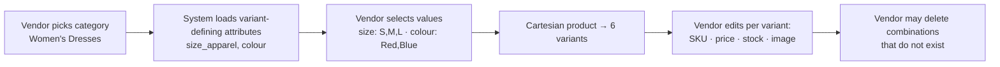

Invariants enforced in the domain:

- Every variant of a product has a value for **every** variant-defining attribute of its category.
- No two variants of a product share the same combination of option values.
- A product with `has_variants = false` still gets exactly one implicit variant, so orders, stock and
  pricing have one uniform thing to point at. **The order line always references a variant, never a
  product.** This removes an entire class of nullable-branch bugs.
- `products.min_price` / `max_price` are maintained by the domain on variant change, for list
  display and price-range filters without aggregating at query time.

### 7.4 Category tree

Stored as an adjacency list (`parent_id`) plus a materialised `path` column for subtree queries
(`path <@ 'women.dresses'` with `ltree`, or a `LIKE 'women/dresses/%'` prefix on text). Depth is
capped at 4. Products may only be assigned to **leaf** categories — this prevents the "some products
are on the branch, some on the leaf" mess that makes category pages inconsistent.

Category changes cascade: moving a category rewrites descendant paths and invalidates the affected
cache keys and sitemap segments in a background job.

### 7.5 Listing lifecycle

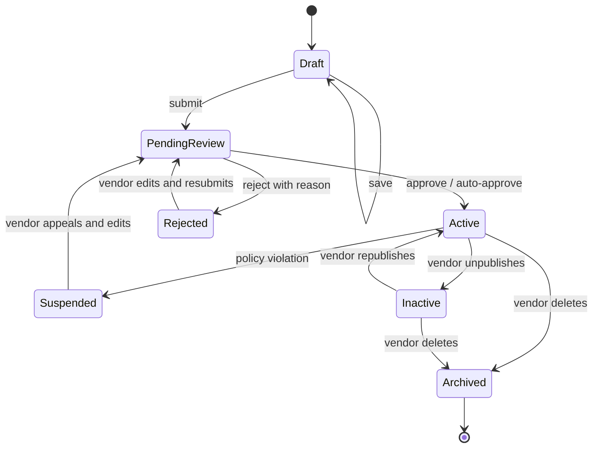

Auto-approval (`BR-C-05`): after a vendor has had 5 listings approved with no rejections, new
listings publish immediately but still pass automated screening (prohibited keywords, banned brand
terms, image hash against a known-violation set, price sanity check). Anything flagged goes to the
manual queue regardless of trust level.

`Archived` never hard-deletes: existing orders reference the product snapshot, and reviews must
survive.

---

## 8. Inventory

### 8.1 Model

Stock lives on `inventory_items`, keyed by variant, with three numbers:

- `on_hand` — physically held by the vendor
- `reserved` — committed to in-flight carts/orders but not yet shipped
- **available** = `on_hand - reserved - safety_stock` (computed, never stored)

Every change writes a `stock_movements` row. The movement ledger is the audit trail; `on_hand` is a
cached projection that must always equal the sum of movements. A nightly reconciliation job asserts
this and alerts on drift.

### 8.2 Reservation flow

```mermaid
sequenceDiagram
    participant B as Buyer
    participant C as Checkout
    participant I as Inventory
    participant P as Payment

    B->>C: Start checkout
    C->>I: Reserve(variant, qty) for each item
    I->>I: SELECT ... FOR UPDATE on inventory_items
    alt available >= qty
        I->>I: reserved += qty; insert reservation (TTL 15 min)
        I-->>C: Reserved
    else insufficient
        I-->>C: Rejected with available qty
        C-->>B: "Only N left" — adjust cart
    end
    C->>P: Create payment intent
    alt Payment succeeds
        P->>I: Commit(reservation)
        I->>I: on_hand -= qty; reserved -= qty; movement row
    else Payment fails or times out
        P->>I: Release(reservation)
        I->>I: reserved -= qty
    end
```

Concurrency is handled with `SELECT ... FOR UPDATE` on the single `inventory_items` row inside the
reservation transaction. Row-level locking on one row per variant is the right granularity — optimistic
concurrency would fail too often on flash-sale SKUs, and a Redis-based counter would risk divergence
from the database of record.

A sweeper job releases expired reservations every minute; a reservation is also released immediately
on explicit cart abandonment or payment failure.

**Overselling is not permitted.** `available` may never go negative; a check constraint enforces it as
the last line of defence.

### 8.3 Low stock and alerts

When `available` crosses `low_stock_threshold` downward, a domain event fires and the vendor is
notified (batched, at most once per day per variant). When `available` reaches 0, the variant becomes
unselectable, and if all variants are out, the product drops in search ranking rather than
disappearing (`BR-C-07`).

---

## 9. Pricing and promotions engine

### 9.1 Price resolution

The effective price of a variant is resolved in order, first match wins:

1. Active flash-sale price for this variant
2. Active campaign price for this product
3. `selling_price` on the variant

`list_price` is display-only strike-through and is subject to the anti-fake-discount rule
(`BR-C-08`): the system records `list_price_effective_from`, and the strike-through renders only if
that price was in effect for a continuous period (default 14 days) in the last 90.

### 9.2 Discount pipeline

Discounts are applied to a `PriceContext` in a fixed order, each stage producing a new immutable
context. Order matters and is fixed so results are reproducible and explainable to a buyer:

```
1. Line prices          → effective price × qty per line
2. Vendor item discounts→ flash sale, bundle, vendor voucher   (reduces commissionable base)
3. Platform discounts   → platform voucher, campaign subsidy   (does NOT reduce commissionable base)
4. Shipping quote       → per vendor parcel, per zone
5. Shipping discounts   → free-shipping threshold, shipping voucher
6. Tax                  → per §12.5
7. Totals               → per BRD §9.4
```

Each applied discount is recorded as a `DiscountApplication { source, sourceId, amount, fundedBy,
appliedToLineIds }`. This record is persisted with the order — it is what makes settlement, refunds
and "why was I charged this?" support tickets answerable. Recomputing discounts at refund time from
current promotion state would give wrong answers, because promotions expire.

### 9.3 Voucher validation

Validated at apply time and **again at order placement** — a voucher can expire or hit its usage cap
between the two. Checks: status and window, scope match (vendor/category/product), minimum spend
against the correct subtotal, `total_limit` (atomic increment, not read-then-write), `per_user_limit`,
new-buyer-only, follower-only, and the stacking rules in BRD §9.5.

`used_count` is incremented with `UPDATE ... SET used_count = used_count + 1 WHERE id = ? AND
used_count < total_limit RETURNING id` — a conditional update, so an oversubscribed voucher fails
correctly under concurrency rather than going over its cap.

### 9.4 Flash sales

Scheduled by Hangfire to flip status at start and end. The stock limit per flash item is enforced
through the same reservation mechanism as normal stock. Product pages show a countdown; the price is
served with a short cache TTL that never outlives the sale end time.

---

## 10. Cart and checkout

### 10.1 Cart

One cart per buyer (or per anonymous ID). Items carry `vendor_id` denormalised so grouping does not
require a join to products. Prices are **snapshotted at add time and re-validated at checkout** — if
a price changed, the buyer is told explicitly rather than silently charged the new amount.

Anonymous carts merge into the user cart on login: quantities sum, capped at available stock.

### 10.2 Checkout steps

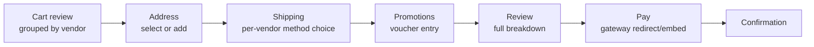

Checkout state is held server-side in a `checkout_session` (Redis, 30 min TTL) keyed by an
idempotency-safe session ID, not in the client. The client never sends prices — it sends selections,
and the server computes money. This is the only safe design.

### 10.3 Shipping quote

For each vendor group: determine parcel weight and dimensions from variant data, resolve the
destination zone from the postcode, and request rates through `IShippingProvider.GetRatesAsync`.
Vendors that exclude the destination zone (BRD §9.6) surface a clear blocking message identifying
which group cannot be shipped, rather than a generic failure.

Checkout calls the provider interface, never a carrier API directly — so at launch it is served by
`ManualShippingProvider` reading the vendor's rate tables, and in Phase 6 the same call returns live
aggregator rates with no change to checkout code (§14). Quoted rates are snapshotted onto the
sub-order at placement; a later rate change never alters what the buyer was charged.

### 10.4 Order placement transaction

The single most critical transaction in the system.

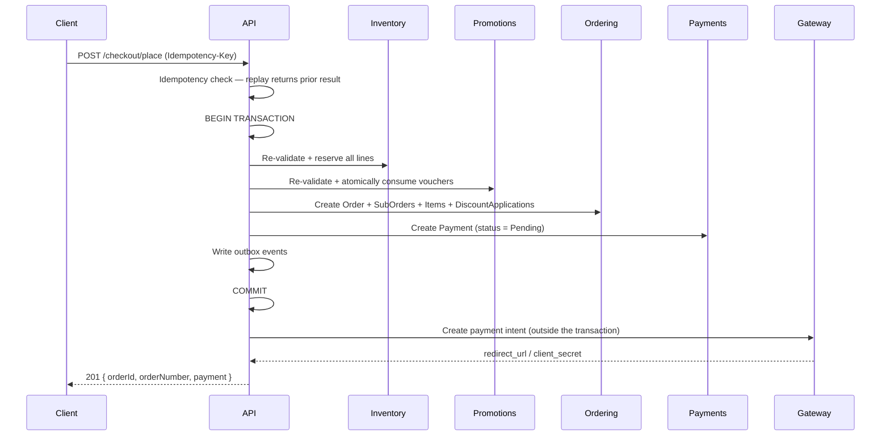

The gateway call sits **outside** the database transaction: never hold a transaction open across a
network call to a third party. If the gateway call fails after commit, the order exists in
`PendingPayment` and a retry or the 15-minute auto-cancel handles it cleanly.

The `Idempotency-Key` header is mandatory on this endpoint. A duplicate key returns the original
response — a double-clicked Pay button must never create two orders.

---

## 11. Orders and the state machine

### 11.1 Structure

- **`Order`** — what the buyer sees and pays once. Holds the address snapshot and the grand total.
- **`SubOrder`** — one per vendor. Owns fulfilment status, shipping, commission and payout. **All
  operational state lives here**, because a buyer's order is rarely in a single state once two
  vendors ship at different times.

### 11.2 Sub-order state machine

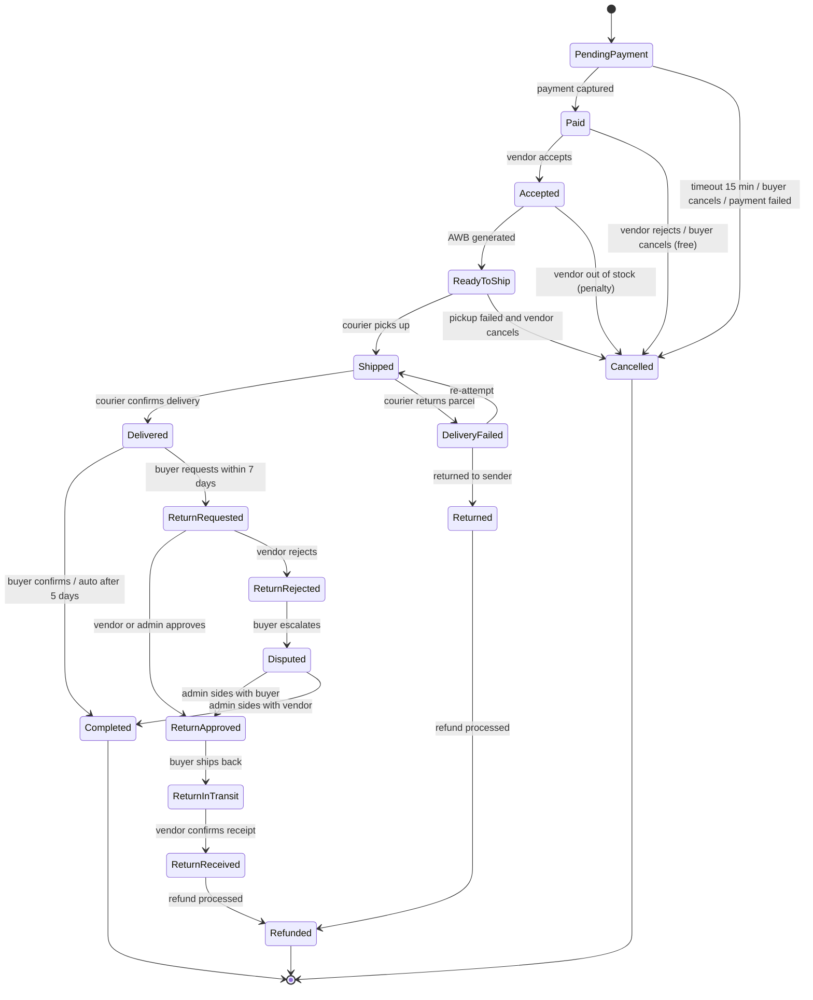

**The state machine is identical in both shipping stages** (§14.5). Only the *source* of the
`Shipped → Delivered` transition differs: the buyer's confirmation in Stage 1, the courier's webhook
in Stage 2. No state is added or removed when Stage 2 lands, which is what makes the deferral safe.

Transitions are implemented as explicit domain methods on the `SubOrder` aggregate
(`Accept()`, `MarkShipped()`, …), each validating the current state and raising a domain event.
An invalid transition returns a failed `Result`, never an exception, and never a silent no-op. Every
transition writes `order_status_history` with the actor.

### 11.3 Timed transitions

| Trigger | Timer | Action |
|---|---|---|
| Unpaid | 15 min (immediate methods) / 24 h (delayed) | Auto-cancel, release stock and vouchers |
| Vendor has not accepted | 24 h | Reminder; escalate at 48 h |
| Vendor has not shipped | 2 business days from `Paid` | Auto-cancel + penalty (`BR-O-02`) |
| **Shipped, buyer silent — Stage 1 only** | **10 days from `shipped_at`** *(setting)* | Auto-complete, release escrow. Bridges the missing courier delivery signal (§14.5) |
| Delivered, buyer silent | 5 days from `delivered_at` | Auto-complete, release escrow (`BR-O-06`) |
| Return request, vendor silent | 2 business days | Auto-approve (`BR-R-03`) |
| Escrow held | Completion | Release to wallet |

Implemented as Hangfire recurring sweeps over indexed status/timestamp predicates rather than a
per-order scheduled job — millions of individual scheduled jobs are an operational liability, and a
sweep is restartable and observable.

"Business days" respects Malaysian public holidays, which vary by state. A `platform.holidays` table
is maintained per year with a national default; vendor SLA uses the vendor's registered state.

### 11.4 Order numbers

Human-readable, non-sequential-looking, safe to read over the phone:
`LS-{yyMMdd}-{base32(6)}` for orders, and `{orderNumber}-{vendorSeq}` for sub-orders.
Never expose raw GUIDs or an incrementing integer that reveals total order volume.

---

## 12. Payments

### 12.1 Abstraction

```csharp
public interface IPaymentProvider
{
    string Name { get; }
    Task<Result<PaymentIntent>> CreateIntentAsync(CreateIntentRequest r, CancellationToken ct);
    Task<Result<PaymentStatus>> GetStatusAsync(string providerIntentId, CancellationToken ct);
    Task<Result<RefundResult>> RefundAsync(RefundRequest r, CancellationToken ct);
    Result<WebhookEvent> ParseWebhook(HttpRequest request, string rawBody);
}
```

Providers are registered by name and selected by configuration, so adding or switching a gateway is
an implementation plus a config change (risk R1 in the project plan). Provider-specific payloads are
stored raw in `jsonb` for support and reconciliation.

### 12.2 Flow

Redirect-based (FPX, e-wallets) and embedded (cards) flows are both supported. The **webhook is the
source of truth**, never the browser redirect — the buyer can close the tab, and the redirect can be
forged.

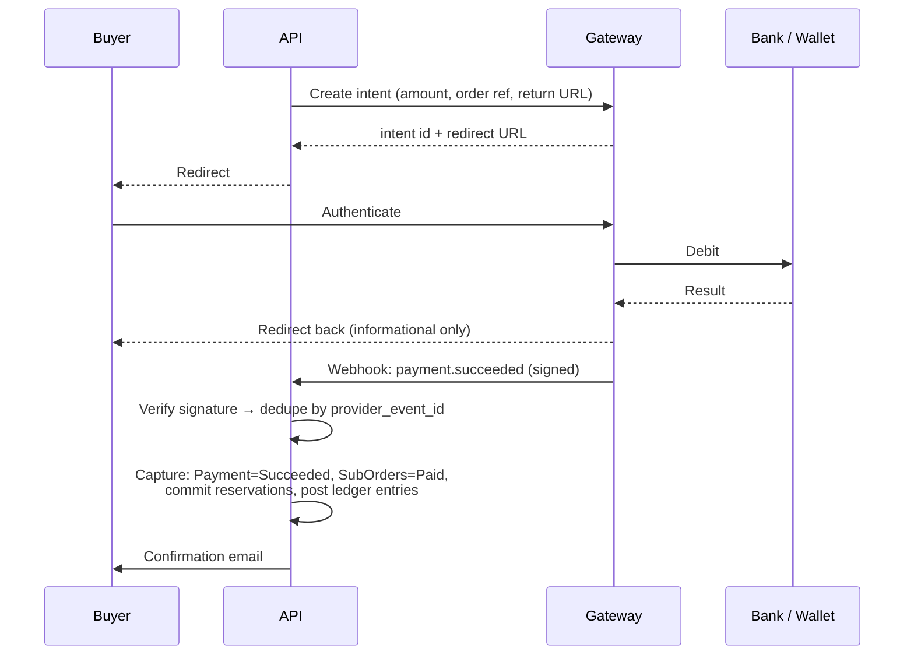

### 12.3 Webhook handling rules

1. Verify the signature before parsing. Reject unsigned or mis-signed payloads with 401 and alert.
2. Persist the raw event to `payment_webhook_events` keyed by `provider_event_id` (unique). A
   duplicate is acknowledged with 200 and dropped — gateways retry, and retries must be free.
3. Acknowledge fast (< 5 s), process asynchronously via the outbox.
4. Handle out-of-order delivery: a `succeeded` event arriving after a `failed` one is resolved by
   querying the gateway for the authoritative status rather than trusting arrival order.
5. Reconcile daily: fetch all gateway transactions for the day and compare against `payments`,
   flagging any mismatch. Webhooks do get lost.

### 12.4 Escrow

We collect the full amount to the platform account and hold it. The `Escrow` ledger account carries
the liability; funds move to the vendor wallet only on completion. This depends on the gateway
supporting a marketplace model — confirm per BRD §6.3 assumption 4. If a split-payment product is
used instead (funds routed to sub-merchant accounts), the ledger design is unchanged; only the payout
execution differs, which is why the ledger is provider-agnostic.

### 12.5 Tax handling

`tax_rate`, `tax_inclusive` and `tax_registration_number` are platform settings, with per-category
overrides. Every order line stores the tax rate applied and the computed tax amount, so historical
orders remain correct when rates change. Invoice records carry the fields an e-invoice submission
needs (seller and buyer identifiers, item classification codes, tax breakdown) even before submission
is implemented — retrofitting identifiers onto historical invoices is not possible.

**Exact rates, thresholds and e-invoice obligations must be confirmed by a Malaysian tax advisor
(BRD §12) before this is finalised.** The design keeps them configurable rather than hard-coded.

---

## 13. Ledger, wallet and payouts

### 13.1 Why double-entry

Vendor balance is a **derived** number: the sum of ledger lines for that vendor's wallet account. It
is cached in `wallets.available_balance` for display, and a reconciliation job asserts that the cache
equals the sum. When they diverge, the ledger wins and the discrepancy is alerted.

A single mutable balance column with `UPDATE balance = balance + x` cannot answer "why is this number
what it is", cannot be audited, and drifts silently under concurrency. Every marketplace that starts
that way rebuilds it later, under pressure, with live money at stake.

### 13.2 Accounts

| Account | Type | Meaning |
|---|---|---|
| `PlatformCash` | Asset | Money actually in the platform bank account |
| `Escrow` | Liability | Collected but not yet earned or owed |
| `VendorWallet:{vendorId}` | Liability | Owed to a specific vendor |
| `CommissionRevenue` | Revenue | Platform earnings |
| `PaymentFees` | Expense | Gateway costs |
| `VoucherExpense` | Expense | Platform-funded discounts |
| `ShippingSubsidy` | Expense | Platform-funded shipping |
| `RefundsPayable` | Liability | Owed back to buyers |

### 13.3 Worked example

Order: item subtotal RM 100, vendor voucher RM 10, platform voucher RM 5, shipping RM 8, commission
8%, gateway fee RM 1.

Buyer pays `100 - 10 - 5 + 8 = RM 93`. Commissionable base is `100 - 10 = RM 90`, commission
`RM 7.20`.

**On payment capture:**

| Account | Debit | Credit |
|---|---|---|
| PlatformCash | 93.00 | |
| VoucherExpense | 5.00 | |
| Escrow | | 98.00 |

**On completion (escrow release):**

| Account | Debit | Credit |
|---|---|---|
| Escrow | 98.00 | |
| CommissionRevenue | | 7.20 |
| PaymentFees *(if borne by platform)* | 1.00 | |
| VendorWallet:{id} | | 90.80 |
| PlatformCash *(shipping recovery to vendor)* | | 8.00 |
| VendorWallet:{id} | | 8.00 |

Every entry balances (Σ debits = Σ credits), enforced by a domain invariant and a database check.
Each `journal_entry` carries an `idempotency_key` derived from the business event (for example
`suborder:{id}:escrow-release`), with a unique index — so a retried job cannot double-post.

### 13.4 Payout run

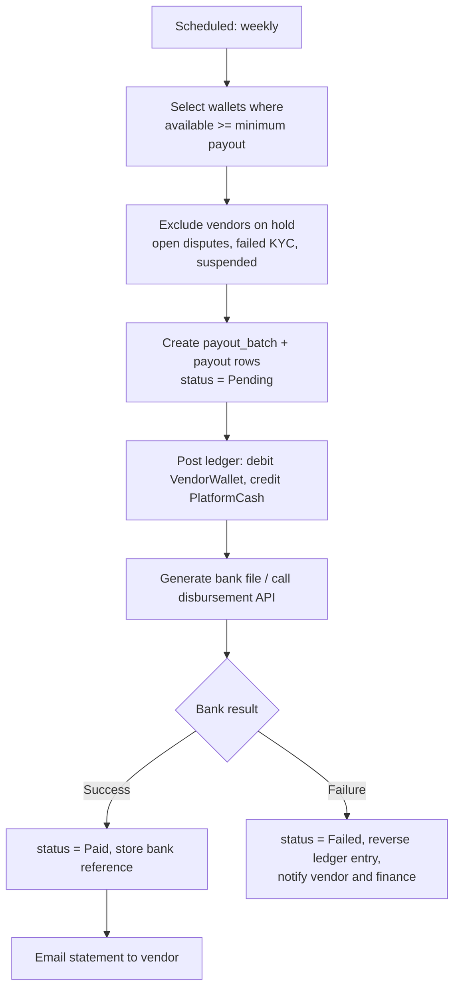

The payout run is idempotent by `batch_id` and re-runnable. Finance can export any batch line by line
against the ledger and the bank statement (`BR-A-09`).

### 13.5 Refunds after payout

If a refund is required after funds have left escrow, the wallet is debited. A negative wallet
balance is permitted, blocks further payouts, and is recovered from subsequent sales — with an
escalation path to direct collection if the vendor goes inactive. This case is rare but must be
modelled from the start, because handling it retroactively means correcting historical books.

---

## 14. Shipping

> **Staged module.** Carrier integration is deferred to **Phase 6, after public launch** (Project
> Plan §6.1, BRD §6.6). The full module is designed here and the *entire seam* — interface, tables,
> zone model, parcel fields, order transitions — is **built in Phase 3**. Only the carrier-facing
> implementation is deferred. Stage 2 must be a second `IShippingProvider` implementation plus UI,
> never a redesign. Section 14.6 lists exactly what is built when.

### 14.1 Abstraction — built in Phase 3

```csharp
public interface IShippingProvider
{
    string Name { get; }
    ShippingCapabilities Capabilities { get; }   // which of the below are actually supported

    Task<Result<IReadOnlyList<ShippingRate>>> GetRatesAsync(RateRequest r, CancellationToken ct);
    Task<Result<ShipmentBooking>> BookAsync(BookingRequest r, CancellationToken ct);
    Task<Result<byte[]>> GetLabelAsync(string trackingNumber, LabelFormat f, CancellationToken ct);
    Task<Result<TrackingSnapshot>> TrackAsync(string trackingNumber, CancellationToken ct);
    Result<TrackingEvent> ParseWebhook(HttpRequest req, string rawBody);
}

[Flags]
public enum ShippingCapabilities
{
    None = 0,
    RateQuoting   = 1,   // can quote live rates
    Booking       = 2,   // can book a pickup
    LabelPrinting = 4,   // can produce an AWB
    LiveTracking  = 8,   // pushes or exposes tracking events
}
```

`Capabilities` is the mechanism that lets Stage 1 and Stage 2 coexist honestly. Callers check it
rather than assuming; the Vendor Admin UI hides the "Book pickup" and "Print label" actions when the
active provider does not advertise them, instead of showing buttons that throw.

**Two implementations:**

| Implementation | Stage | Capabilities |
|---|---|---|
| `ManualShippingProvider` | 1 — Phase 3 | `RateQuoting` only, served from the vendor's own rate tables. `BookAsync`/`GetLabelAsync` return `NotSupported`; `TrackAsync` returns the manually entered tracking number with no events |
| `AggregatorShippingProvider` | 2 — Phase 6 | All four. EasyParcel or equivalent, covering the main Malaysian couriers under one contract rather than integrating each separately |

Direct per-courier implementations can be added later behind the same interface once volume
justifies negotiating individual rates.

### 14.2 Rate calculation

Vendors choose per store: **flat rate per zone**, **weight-based tiers**, **free shipping** above a
threshold, or — from Stage 2 — **live aggregator rates**. The first three are pure table lookups and
need no external service, which is precisely why Stage 1 can launch.

Volumetric weight is `(L × W × H) / 5000` kg, and the chargeable weight is the greater of actual and
volumetric. Dresses and bags are frequently volumetric-billed, so getting this wrong systematically
undercharges shipping. **This is implemented in Stage 1**, even though nothing verifies it against a
courier yet — the vendor's manual rate tiers are keyed on chargeable weight, so the calculation has to
be right from the start, and it is the same calculation Stage 2 sends to the aggregator.

Parcel dimensions come from variant data; vendors who leave dimensions blank fall back to a category
default, with a warning that quotes may be inaccurate.

### 14.3 Stage 1 — manual fulfilment flow

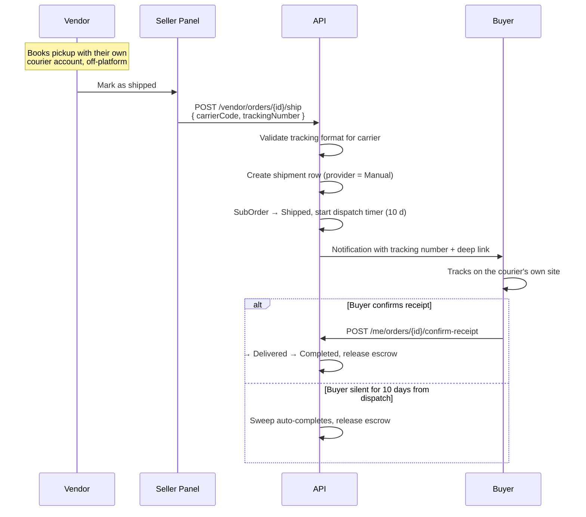

Requirements specific to Stage 1:

- `carriers` is seeded with the common Malaysian couriers (J&T Express, Pos Laju, Ninja Van,
  City-Link, DHL eCommerce, Flash Express, Skynet, GDEX) each with a **tracking number regex** and a
  **tracking URL template** (`https://…/track?no={trackingNumber}`). Validating the format on entry
  catches the most common support ticket — a mistyped tracking number — at the point of entry rather
  than three days later.
- The tracking deep link opens the courier's own site. We do not scrape courier tracking pages:
  it is fragile, and it breaks silently.
- A vendor may correct a tracking number; corrections are audit-logged and re-notify the buyer.
- Nudge notifications to the vendor at 24 h and 48 h after `Paid` if not yet marked shipped, feeding
  the existing SLA sweep (§21.2).
- `shipments.provider = 'Manual'` so Stage 2 can distinguish historical manual shipments and avoid
  trying to poll them.

### 14.4 Stage 2 — integrated tracking

Webhooks where the aggregator supports them, with a polling fallback every 6 hours for active
shipments (capped, with exponential backoff, stopping at delivery or 30 days). Each event writes to
`shipment_tracking_events`; a mapped "delivered" event transitions the sub-order and starts the
return-window and auto-complete timers.

Also in Stage 2: pickup booking, AWB generation and printing, and **shipping cost reconciliation** —
comparing the rate quoted at checkout against what the courier actually billed, since volumetric
re-measurement at the depot is a routine source of discrepancy.

### 14.5 The delivery-signal gap, and how it is bridged

This is the one genuine functional consequence of deferring the module, and it is worth stating
precisely.

Escrow release is triggered by delivery (§13, BRD §9.2). Stage 1 has no courier feed, so there is no
authoritative delivery event. Rather than special-casing the order state machine, we keep the same
states and change only **what produces the `Delivered` transition**:

| | Stage 1 | Stage 2 |
|---|---|---|
| `Shipped` → `Delivered` | Buyer confirms receipt | Courier `delivered` webhook event |
| Auto-complete fallback | 10 days from `shipped_at` *(configurable)* | 5 days from `delivered_at` |
| Return window start (`BR-R-01`) | `delivered_at`, set when the buyer confirms; if the fallback fired, from `shipped_at + 10d` | `delivered_at` from the courier |

Implementation notes:

- The fallback duration is a platform setting (`shipping.stage1_autocomplete_days`), not a constant.
  When Stage 2 lands, existing in-flight manual shipments keep their dispatch-based timer — the
  sweep reads the setting **and** `shipments.provider`, so behaviour does not change retroactively
  for orders already placed.
- `sub_orders.delivered_at` stays a real column in both stages. Nothing downstream — returns,
  reviews, escrow, reporting — needs to know which stage produced it.
- Vendors are paid a few days later in Stage 1. That is a disclosed commercial trade-off
  (BRD §6.6), not a bug to work around in code.

### 14.6 What is built when

| Component | Phase 3 (Stage 1) | Phase 6 (Stage 2) |
|---|---|---|
| `IShippingProvider` + `ShippingCapabilities` | ✔ | reused |
| `carriers`, `shipping_zones`, `shipping_rates`, `vendor_shipping_settings` | ✔ | reused |
| `shipments`, `shipment_tracking_events` tables | ✔ (events table stays empty) | populated |
| `pickup_requests` table | ✔ (unused) | populated |
| Zone resolution from postcode | ✔ | reused |
| Volumetric / chargeable weight | ✔ | reused |
| Vendor rate configuration UI | ✔ | retained as an option |
| Checkout rate quoting | ✔ manual tables | live rates added |
| Mark-as-shipped + tracking entry | ✔ | retained as a fallback |
| Tracking number validation + deep links | ✔ | retained |
| `ManualShippingProvider` | ✔ | retained |
| `AggregatorShippingProvider` | – | ✔ |
| Pickup booking, AWB generation | – | ✔ |
| Tracking webhook endpoint + poller | – | ✔ |
| Courier-driven `Delivered` transition | – | ✔ |
| Shipping cost reconciliation | – | ✔ |

Because the tables and interface exist from Phase 3, Phase 6 adds **no migration to the ordering
module** — a deliberate constraint, since retrofitting shipping columns onto a live `sub_orders`
table with real money in flight is exactly the kind of change we want to avoid post-launch.

---

## 15. Returns, refunds, disputes

### 15.1 Flow

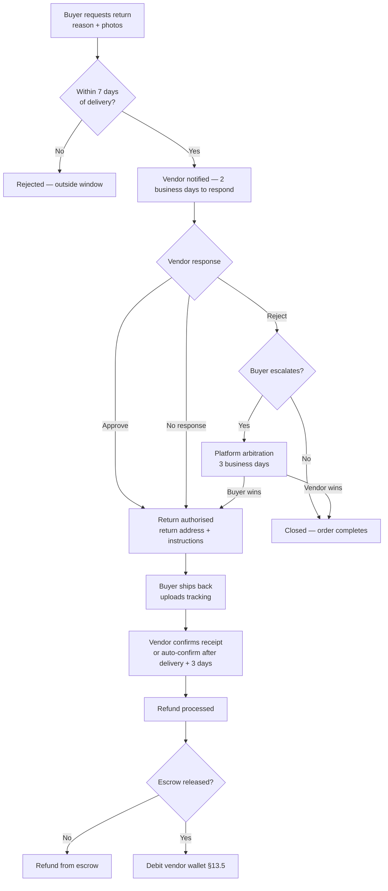

### 15.2 Refund rules

Refunds go to the original payment method (`BR-R-05`); where a gateway cannot refund a method (some
e-wallet and FPX flows), the fallback is a bank transfer to the buyer, recorded against the same
refund entity so the books stay correct. Partial refunds are per order line with a quantity, so
returning one of three items is a first-class case, not a manual adjustment. Shipping is refunded when
the fault is the vendor's. Return shipping cost is allocated per `BR-R-06`. Every refund posts a
reversing ledger entry — nothing is edited in place.

### 15.3 Dispute evidence

Both sides upload evidence; all messages and files are captured in an immutable, timestamped trail.
Admins see both sides plus the order, tracking and chat history in one arbitration view. Decisions
record the deciding admin, the reason and the outcome (`BR-R-08`).

---

## 16. Search

### 16.1 MVP: PostgreSQL

A generated `tsvector` column on `products` weighted `A` title, `B` brand + category, `C` attribute
values, `D` description, with a GIN index. `pg_trgm` on `title` provides typo tolerance and
autocomplete. `unaccent` normalises input.

Faceted filtering joins `product_attribute_values`; facet counts come from a single grouped query
over the filtered set. Ranking combines text rank with `sold_count`, `rating`, recency and a vendor
performance factor, weighted by configurable coefficients so merchandising can tune without a
deployment.

### 16.2 The interface, and the exit

All search goes through `ISearchService` from day one:

```csharp
Task<SearchResult> SearchAsync(SearchQuery q, CancellationToken ct);
// SearchQuery: text, categoryId, vendorId, filters, priceRange, sort, page, size
```

Swapping in OpenSearch or Meilisearch is then one implementation plus an indexing pipeline (already
event-driven, since product changes raise domain events). Trigger for the swap: catalog above
~200k SKUs, p95 search latency above 300 ms, or facet queries becoming the top database cost. This
is planned, not hoped for (risk R8).

### 16.3 Search quality instrumentation

Log every query with result count, click position and whether it converted. Track zero-result rate
and null-click rate weekly — these are the two numbers that tell you search is failing before revenue
does. Maintain a synonym table (`baju` → `dress`, `kasut` → `shoes`, `beg` → `bag`) since buyers mix
Malay and English in one query; this is essential in this market, not optional polish.

---

## 17. Media

Direct-to-storage upload: the client requests a pre-signed PUT URL, uploads to MinIO/S3 without
passing through the API, then confirms. This keeps large uploads off the application servers.

On confirmation, a background job validates the file (real image sniffing, not extension trust;
dimension and size limits; EXIF stripped), generates derivatives (thumb 200 px, card 400 px, detail
800 px, zoom 1600 px) in WebP with JPEG fallback, computes a perceptual hash for duplicate and
known-violation detection, and marks the asset ready. Products cannot be published while media is
still processing.

Serving is via `cdn.{platform}.com` with long-lived immutable cache headers on content-hashed keys.
Limits: 9 images per product, 5 MB each, plus one video up to 30 s / 50 MB.

---

## 18. Notifications and messaging

### 18.1 Notifications

Channels: email (transactional), SMS (critical only — cost), in-app notification centre, and web push
later. Templates are database-stored with per-locale variants so content can change without a
deployment. Every notification is driven by a domain event through the outbox, is idempotent by
`(event_id, channel, recipient)`, and respects per-user preferences — except a short list of
transactional messages (payment receipt, refund issued, security alert) that cannot be disabled.

Suppression list for bounces and complaints; delivery status logged per send.

### 18.2 Messaging

Conversations are scoped to a buyer and a vendor, optionally anchored to a product or order.
Delivery is via SignalR when connected, with an email digest for unread messages after 30 minutes.
Attachments reuse the media pipeline. Vendor response rate and median response time are computed from
message timestamps for `BR-T-07`. Phone numbers, emails and external links are masked in message
bodies per `BR-T-08`, with the raw text retained for dispute evidence.

On-platform chat is a **Phase 5** feature. In v1, buyer↔vendor conversation happens in WhatsApp and
Messenger — see §18.3.

### 18.3 Conversational ordering — the v1 order path

> **This is how v1 takes orders.** There is no cart, no checkout, no payment and no order record in
> v1 (Project Plan §6.2). A buyer taps through from a product page into WhatsApp or Messenger with a
> pre-filled message, and the sale is closed in chat. Everything here is built in Phase 3 and
> **kept** when checkout arrives in Phase 4 — the two run side by side, per vendor.

#### 18.3.1 Vendor contact configuration

`vendors.storefront_contact`:

| Field | Notes |
|---|---|
| `whatsapp_number` | **E.164, stored without `+`** — `wa.me` requires that format. Validated on save |
| `whatsapp_enabled` | Per-vendor toggle |
| `messenger_page` | Page username or numeric page ID |
| `messenger_enabled` | |
| `preferred_channel` | Which button is primary on the product page |
| `business_hours`, `timezone` | Drives an "usually replies within…" hint and an out-of-hours notice |
| `order_template_override` | Optional vendor-authored template; falls back to the platform default |

#### 18.3.2 Deep links — and an asymmetry worth knowing

**WhatsApp** supports pre-filled message text:

```
https://wa.me/{e164_no_plus}?text={urlencoded_message}
```

**Messenger does not.** `https://m.me/{page}` opens the conversation but **cannot pre-fill the user's
message**; the `ref` parameter is delivered to a *bot* via the messaging-referrals webhook, not
rendered as user text. So:

- **WhatsApp** — full pre-filled template. This is the primary channel, and should be the default
  where the market allows (both Bangladesh and Italy are WhatsApp-first; Messenger is a secondary
  channel in Bangladesh).
- **Messenger** — the buyer lands in the chat, and we show the reference code and product details
  **on the page** with a copy button so they can paste it. Set expectations in the UI accordingly
  rather than pretending the flows are equivalent.
- Upgrading Messenger to a true pre-filled/automated flow requires a Messenger bot plus the
  Cloud API — deferred, see §18.3.7.

#### 18.3.3 Message template

Default template, per-locale, editable by the vendor:

```
Hi {vendorName}! I'd like to order:

{productTitle}
{variantSummary}          e.g. Size: M · Colour: Red
Price: {price}
Qty: {quantity}
Ref: {referenceCode}

{productUrl}
```

Constraints that matter in practice:

- **Keep it short.** The whole URL must survive being passed through link previews, QR codes and
  in-app browsers. Target well under 1,000 characters total; some clients truncate long ones.
- URL-encode the body once, correctly — double-encoding is the most common bug here, and it surfaces
  as literal `%20` in the buyer's message.
- Emoji are fine and read as normal in this market, but keep them out of the reference code.
- Templates are stored per locale (`bn`, `en`, `it`), and the buyer's active locale selects one.

#### 18.3.4 Reference code and the redirect endpoint

The buyer does **not** click `wa.me` directly. They click a platform URL that records the intent and
then redirects:

```
GET /go/order/{inquiryRef}  →  302  →  https://wa.me/…?text=…
```

Why this indirection:

1. **Reliable tracking.** A client-side analytics event before an external navigation is routinely
   lost. A server-side record before the 302 is not.
2. **Short, clean links** that survive being shared or turned into a QR code.
3. The template is built **server-side**, so price and stock are current at click time rather than
   whatever the page was rendered with.
4. It gives one place to rate-limit and to block abuse.

`referenceCode` is short, unambiguous when read aloud or typed, and greppable by the vendor —
e.g. `LS-7K4M2`. Excludes visually ambiguous characters (`0/O`, `1/I/l`).

#### 18.3.5 The inquiry record

```
ordering.order_inquiries
  id, reference_code (unique), vendor_id, product_id, variant_id, quantity,
  price_snapshot, channel (WhatsApp | Messenger),
  storefront_host, locale, referrer, user_agent_class,
  buyer_user_id (nullable — usually null in v1),
  status (Clicked | Contacted | Won | Lost | Expired),
  outcome_note, outcome_set_by, outcome_set_at,
  created_at
```

**Deliberately shaped like a thin order** so Phase 4 can present continuous history rather than a hard
break at the migration. It carries no buyer personal data — that is precisely the property that keeps
the Italy footprint small (doc 03 §0.1).

`status` is vendor-maintained and inherently approximate. `Clicked` is the only value the system knows
for certain; everything past it is the vendor's word. **The UI must not present inquiry counts as
sales.**

#### 18.3.6 Manual stock, and how to stop it lying

The vendor sells in chat, then decrements stock themselves. This is the single largest operational
risk in v1 (Plan R13). Mitigations, in order of effectiveness:

1. **One-tap decrement from the inquiry list.** Marking an inquiry `Won` offers "reduce stock by
   {quantity}" pre-filled and applies it in one action. Reducing the work is worth more than any
   reminder.
2. **Availability bands, not exact counts.** Show `In stock` / `Only a few left` / `Out of stock`
   rather than "7 left". Small drift then stops being a visible falsehood, and it removes the most
   common buyer complaint.
3. **Staleness signal.** `inventory_items.stock_confirmed_at`, surfaced on the vendor dashboard as
   "stock last confirmed 6 days ago" with a one-tap "still accurate" confirmation.
4. **Daily digest** to vendors with open inquiries and stale stock.
5. **Auto-flag**: a product with inquiries but no stock movement for N days is flagged for review.

All decrements write `stock_movements` with `type = ManualSale` and the inquiry reference — so when
Phase 4 arrives there is a real movement history, not a mystery.

#### 18.3.7 Upgrade path: WhatsApp Business Cloud API

v1 uses **click-to-chat links only** — no Meta approval, no API integration, works on day one. That is
the right starting point and it should not be skipped in favour of the API.

The Cloud API becomes worthwhile when we want the platform to *send* messages: order confirmations,
shipping updates, abandoned-inquiry follow-ups, payment links. It requires a Meta Business account,
business verification, a dedicated number, and **pre-approved message templates** — a lead time
measured in weeks, so start it during Phase 4 if it is wanted, not Phase 3.

Note that a number used with the Cloud API can no longer be used in the normal WhatsApp app, which is
often a blocker for small sellers who run their shop from their personal phone. Expect this to be a
per-vendor opt-in, not a platform-wide migration.

#### 18.3.8 What this path deliberately does not do

Stated plainly so nobody plans around capabilities that do not exist:

- **No verification that a sale happened.** Hence no commission in v1 (Plan §6.2, R14).
- **No stock reservation.** Two buyers can click the same last item; the vendor resolves it in chat.
- **No delivery or read receipts** — we know the click, not the conversation.
- **No price enforcement.** The vendor can agree any price in chat.
- **No buyer identity.** Unless the buyer separately registers, we know nothing about them.
- **No dispute trail on-platform.** The conversation is in Meta's app, not ours.

Each of these is resolved by Phase 4 checkout, and none of them is worth blocking v1 for.

---

## 19. API design

### 19.1 Conventions

| Aspect | Convention |
|---|---|
| Base | `https://api.{platform}.com/v1` |
| Versioning | URL path major version; additive changes only within a version |
| Format | JSON, `camelCase`, UTC ISO-8601 timestamps |
| Money | `{ "amount": "93.00", "currency": "MYR" }` — decimal as **string**, never a float |
| Errors | RFC 9457 `application/problem+json` with a stable `type` URI and field-level `errors` |
| Pagination | Cursor-based for feeds and infinite scroll; page-based for admin tables. Always returns `total` where feasible |
| Filtering | Explicit named query parameters, not a generic query language |
| Auth | `Authorization: Bearer <jwt>` |
| Correlation | `X-Correlation-Id` accepted and echoed; generated when absent |
| Idempotency | `Idempotency-Key` required on payment, order placement, refund and payout endpoints |

### 19.2 Endpoint groups

Endpoints are grouped by **surface** first, then resource, because the same resource has very
different shapes and permissions per surface:

```
/v1/catalog/*         public read: products, categories, search, storefronts
/v1/cart/*            buyer
/v1/checkout/*        buyer
/v1/me/*              buyer: profile, addresses, orders, reviews, wishlist
/v1/auth/*            all
/v1/vendor/*          seller panel — always scoped to the caller's vendor
/v1/admin/*           super admin
/v1/webhooks/*        payment and courier callbacks, signature-verified, unauthenticated
/v1/internal/*        health, metrics — not publicly routed
```

A representative selection is listed in [Appendix C](#appendix-c--representative-endpoints); the
OpenAPI document is the authoritative and complete contract.

### 19.3 Response shape

Single resources return the object directly. Collections return
`{ "items": [...], "page": {...} }`. No envelope on success — the HTTP status carries that
information.

### 19.4 Public catalog endpoints and hosts

`/v1/catalog/*` behaves differently by resolved tenant: on a storefront host, results are implicitly
filtered to that vendor. The client does not pass `vendorId` — the server derives it from the host,
so a storefront cannot be tricked into leaking another vendor's data by parameter tampering.

### 19.5 Rate limits

| Scope | Limit |
|---|---|
| Anonymous, per IP | 100 req/min |
| Authenticated, per user | 300 req/min |
| Login / password reset | 5 per 15 min per identifier + per IP |
| Search | 30 req/min per IP |
| Write endpoints, per user | 60 req/min |
| Vendor bulk import | 5 per hour |
| Webhooks | Excluded (allow-listed by source and signature) |

Implemented with ASP.NET Core rate limiting backed by Redis so limits hold across instances.
Responses include `Retry-After`.

### 19.6 Idempotency implementation

`Idempotency-Key` plus the endpoint and the hash of the request body are stored with the response for
24 hours. A repeat with the same key and body returns the stored response; the same key with a
different body returns `422` — that combination is a client bug and silently succeeding would hide it.

---

## 20. Frontend architecture

### 20.1 Workspace

One Angular workspace, three applications, shared libraries:

```
apps/
  storefront/   SSR — marketplace + vendor storefronts (the same app, tenant-aware)
  seller/       SPA — vendor admin
  admin/        SPA — super admin
libs/
  ui/           design system: buttons, forms, tables, modals, layout
  data-access/  generated API clients + typed state facades
  auth/         guards, interceptors, token refresh, permission directives
  i18n/         translation loading, currency and date formatting
  util/         shared types, validators, formatters
```

Marketplace and vendor storefronts are **one application**, not two. They share the product detail
page, cart and checkout; only the layout shell, theming and an implicit vendor filter differ. Two
applications would mean maintaining the product page twice, and it would drift.

### 20.2 Rendering

| App | Mode | Why |
|---|---|---|
| storefront | **SSR + hydration** | SEO is a hard requirement (Project Plan §2.5); first paint on mobile 4G matters for conversion |
| seller | SPA | Behind auth; no SEO value; SSR would add complexity for nothing |
| admin | SPA | Same |

SSR concerns: transfer state to avoid double-fetching, per-request tenant context from the `Host`
header, and a server-side cache for catalog responses. Product and category pages are cached at the
edge with a short TTL and revalidated on product-update events.

### 20.3 State

Angular **signals** for component and feature state; a lightweight store per feature exposing signal
selectors. NgRx is not adopted globally — most state here is server state, and a query-cache pattern
(fetch, cache, invalidate on mutation) with signals covers it without the boilerplate. Genuinely
complex client state (the checkout wizard, the product editor with variant generation) gets a
dedicated feature store.

### 20.4 Theming

Vendor storefront theming uses CSS custom properties set from the vendor record on the server, so the
themed first paint is correct with no flash of unstyled content:

```html
<body style="--brand-accent:#C2185B; --brand-accent-contrast:#fff">
```

Vendors choose an accent colour and a logo; they do not get arbitrary CSS. Arbitrary CSS means
arbitrary breakage and a support burden, and it is an XSS vector. About-page content is sanitised
HTML from a restricted editor.

### 20.5 Performance budgets

| Metric | Budget |
|---|---|
| Storefront initial JS (gzipped) | ≤ 180 KB |
| LCP, mobile 4G | ≤ 2.5 s |
| INP | ≤ 200 ms |
| CLS | ≤ 0.1 |
| Route chunk | ≤ 80 KB |

Enforced in CI with bundle-size checks and Lighthouse CI on key routes.

### 20.6 Other frontend requirements

Route-level lazy loading; `OnPush` change detection everywhere; typed reactive forms; image
`srcset`/lazy loading with explicit dimensions to protect CLS; skeletons over spinners; permission
directives that hide unauthorised UI (with the real check always server-side); i18n via Angular's
built-in system with runtime locale switching; WCAG 2.1 AA — semantic HTML, focus management, visible
focus rings, tested with a screen reader on the checkout path.

---

## 21. Background jobs and the outbox

### 21.1 Transactional outbox

Domain events are written to `platform.outbox_messages` in the same transaction as the state change.
A dispatcher polls (every 5 s, `FOR UPDATE SKIP LOCKED`) and invokes handlers, with retry and
exponential backoff, moving permanently failed messages to a dead-letter table with alerting.

This is what makes "order paid → send email + update search index + post ledger entry" reliable
without distributed transactions. Handlers must be idempotent, since at-least-once delivery is the
guarantee.

### 21.2 Scheduled jobs

| Job | Schedule | Purpose |
|---|---|---|
| Expire stock reservations | 1 min | Release abandoned checkouts |
| Cancel unpaid orders | 5 min | Timeout enforcement |
| Vendor SLA sweep | 15 min | Auto-cancel unshipped, send reminders |
| Auto-complete delivered orders | Hourly | Escrow release trigger |
| Auto-approve silent return requests | Hourly | `BR-R-03` |
| Auto-complete shipped orders *(Stage 1)* | Hourly | Dispatch-based escrow release, §14.5. Retired when Stage 2 covers all in-flight orders |
| Poll shipment tracking | 6 h | Webhook fallback. **Stage 2 only** — dormant until the aggregator provider is active |
| Flash sale start/stop | Per schedule | Price flips |
| Payment reconciliation | Daily 02:00 | Compare gateway vs `payments` |
| Inventory reconciliation | Daily 03:00 | Movements vs `on_hand` |
| Ledger reconciliation | Daily 03:30 | Wallet cache vs ledger sum |
| Payout run | Weekly | §13.4 |
| Sitemap regeneration | Daily | Per host |
| Custom domain health check | Daily | DNS + certificate expiry |
| Vendor performance snapshot | Daily | Scorecard metrics |
| Search index maintenance | Daily | Analyse, reindex, synonym reload |
| Backup verification | Daily | Restore test into a scratch database |

All jobs are idempotent, singleton-locked via Redis (so a job never runs twice concurrently across
instances), instrumented with duration and failure metrics, and alert on overrun.

---

## 22. Caching

| Data | Store | TTL | Invalidation |
|---|---|---|---|
| Host → vendor resolution | Redis | 5 min | On slug/domain change |
| Category tree | Redis | 1 h | On category change |
| Product detail projection | Redis | 10 min | On product/variant/stock event |
| Category listing page 1 | Redis | 5 min | On product publish in that category |
| Facet counts | Redis | 5 min | Time-based only |
| Storefront config | Redis | 15 min | On storefront save |
| Platform settings | In-memory + Redis pub/sub | Until changed | On settings write |
| Session / checkout state | Redis | 30 min | On completion |
| Rate-limit counters | Redis | Window | Automatic |
| Static assets | CDN | 1 year | Content-hashed filenames |

**Stock levels are never cached.** A cached stock number is a wrong stock number, and overselling is
more expensive than a database read.

Cache keys are namespaced with a version prefix (`v1:product:{id}`) so a bulk invalidation is a prefix
bump rather than a scan.

---

## 23. Observability

**Logging** — Serilog, structured JSON, with correlation ID, user ID, vendor ID and surface on every
entry. PII is redacted by a destructuring policy, not by developer discipline. Levels: Information
for business events, Warning for handled failures, Error for unhandled.

**Tracing** — OpenTelemetry across HTTP, EF Core, Redis, HTTP clients and Hangfire. Checkout and
payment are traced end to end, since that is where "it was slow" becomes an expensive question.

**Metrics** — technical (request rate, latency percentiles, error rate, database pool saturation,
cache hit ratio, job queue depth and lag) and business (orders per minute, payment success rate by
method, checkout abandonment stage, search zero-result rate). Business metrics are the ones that
detect a broken deployment fastest — a drop in orders per minute beats a CPU graph.

**Health checks** — `/health/live` (process), `/health/ready` (database, Redis, storage, gateway
reachability). Gateway checks are cached to avoid hammering a third party.

**Alerting (initial set)** — payment success rate below 95% over 15 min; order rate down more than
50% versus the same hour last week; outbox lag above 5 min; failed payouts; ledger reconciliation
mismatch; certificate expiring within 7 days; error rate above 1%; database connections above 80%.

Backend choice for logs, traces and metrics belongs to the infrastructure document.

---

## 24. Security

| # | Area | Requirement |
|---|---|---|
| S-1 | Transport | TLS 1.2+ everywhere; HSTS with preload; HTTP always redirects |
| S-2 | Headers | CSP (no `unsafe-inline`, nonce-based), `X-Content-Type-Options`, `Referrer-Policy`, `Permissions-Policy`, `X-Frame-Options: DENY` on admin surfaces |
| S-3 | Injection | Parameterised queries only; no string-concatenated SQL. EF is the default path, and any raw SQL is reviewed |
| S-4 | XSS | Angular sanitisation left on; vendor-supplied HTML sanitised server-side against an allow-list; `bypassSecurityTrust*` is prohibited outside a reviewed helper |
| S-5 | CSRF | Bearer tokens in headers for the API; the refresh cookie is `SameSite=Strict` plus a double-submit token on the refresh endpoint |
| S-6 | Authorisation | Every endpoint declares a permission; tenant scope enforced in the repository layer (§4.4); an integration test asserts cross-vendor access is denied |
| S-7 | IDOR | Resources are always fetched with the tenant predicate applied, never "fetch then check" |
| S-8 | Secrets | Never in the repository; environment or secret store; rotation runbook; separate keys per environment |
| S-9 | PII at rest | Bank account numbers and KYC documents encrypted with a separate key; database-level encryption for the rest per the infrastructure document |
| S-10 | Uploads | Content-type sniffing, size limits, EXIF stripping, served from a separate origin, never executed |
| S-11 | Rate limiting and brute force | §19.5; progressive lockout on failed logins; CAPTCHA after repeated failures |
| S-12 | Webhooks | Signature verification mandatory; replay window enforced; source IP allow-listed where the provider publishes ranges |
| S-13 | Audit | Immutable append-only audit log for money, stock, vendor status, moderation and permission changes (`BR-A-02`) |
| S-14 | Dependencies | Automated vulnerability scanning in CI; a policy for how fast criticals are patched |
| S-15 | Fraud | Velocity checks on new accounts, mismatched billing/shipping, high-value first orders, and rapid cancellation patterns; manual review queue |
| S-16 | PDPA | Consent records; data export and deletion request workflows; retention schedule; documented breach response |
| S-17 | Penetration test | Before public launch; criticals and highs closed before go-live |

---

## 25. Non-functional requirements

| ID | Requirement | Target | How verified |
|---|---|---|---|
| NFR-01 | API p95 latency (read) | < 300 ms | Load test + production metrics |
| NFR-02 | API p95 latency (write) | < 800 ms | Same |
| NFR-03 | Search p95 | < 400 ms | Same |
| NFR-04 | Storefront LCP, mobile 4G | < 2.5 s | Lighthouse CI |
| NFR-05 | Throughput | 500 req/s sustained; 2,000 req/s peak | k6 |
| NFR-06 | Concurrent checkouts | 100/s without overselling | Concurrency test with contended SKUs |
| NFR-07 | Availability | 99.5% monthly | Uptime monitoring |
| NFR-08 | RPO | ≤ 15 min | Restore drill |
| NFR-09 | RTO | ≤ 4 h | Restore drill |
| NFR-10 | Data volume year 1 | 30k SKUs, 300 vendors, 50k buyers, 400k orders | Capacity planning |
| NFR-11 | Media storage year 1 | ~500 GB with derivatives | Capacity planning |
| NFR-12 | Mobile support | iOS Safari 16+, Chrome Android last 2 versions | Device testing |
| NFR-13 | Accessibility | WCAG 2.1 AA on buyer surfaces | axe + manual audit |
| NFR-14 | Localisation | EN at launch; no hard-coded user-facing strings | Lint rule + review |
| NFR-15 | Deployment | Zero-downtime, rollback within 10 min | Deployment drill |

---

## 26. Testing

| Level | Scope | Tooling | Gate |
|---|---|---|---|
| Unit | Domain invariants, price and commission maths, state machine transitions | xUnit, FluentAssertions, NSubstitute | ≥ 80% on domain and application layers |
| Property-based | Money arithmetic, discount pipeline, ledger balancing | FsCheck | Ledger always balances; no negative totals |
| Integration | Endpoints against a real Postgres and Redis | Testcontainers, `WebApplicationFactory` | All critical paths |
| Contract | OpenAPI matches implementation; generated client compiles | Schema diff in CI | No breaking change without a version bump |
| Architecture | Module boundaries, tenant-scoped repository usage, no `DateTime.Now` | NetArchTest | Zero violations |
| Security | SAST, dependency scan, secret scan | CI tooling | No new critical/high |
| Frontend unit | Components, pipes, stores | Vitest / Jest | ≥ 70% |
| E2E | Buyer purchase, vendor onboarding and fulfilment, admin approval, return flow | Playwright | Green before release |
| Load | Checkout under contention, search, catalog browse | k6 | NFR-01…06 met |
| UAT | Business scenarios with pilot vendors | Manual, scripted | Sign-off before launch |

**Test scenarios that must exist**, because these are where marketplaces actually break:

- Two buyers checking out the last unit of the same SKU simultaneously — exactly one succeeds.
- A payment webhook delivered twice, and delivered out of order.
- A cart with items from three vendors, one of whom cannot ship to Sabah.
- A Stage 1 order where the buyer never confirms receipt — auto-completes on the dispatch timer and
  releases escrow exactly once.
- Switching a vendor from `ManualShippingProvider` to `AggregatorShippingProvider` while they have
  in-flight shipments — existing orders keep dispatch-based timers, new ones use courier events.
- A voucher at its usage cap hit by 50 concurrent requests — never exceeds the cap.
- A refund requested after escrow release, taking the wallet negative.
- A vendor slug change while a buyer holds an open storefront tab.
- A custom domain whose DNS is removed after activation.
- A partial return of 1 of 3 items, with correct commission reversal.

---

## 27. Build, deploy, environments

Documented fully in `03 — Infrastructure & Deployment` once server details are available. Committed
now:

- Everything runs in Docker; local development is `docker compose up` with seeded data.
- Migrations run as a **separate step before** the application starts, via `Lifestyle.Migrator`,
  never automatically on application startup.
- Database changes follow expand → migrate → contract, so a deployment can be rolled back without a
  destructive down-migration.
- Configuration comes from environment variables; secrets from a secret store, never from a file in
  the repository.
- Zero-downtime deployment with health-gated cutover.
- Automated daily backups with an automated weekly restore test — a backup that has never been
  restored is not a backup.

**Infrastructure questions to answer with your server details:** OS and current stack · CPU, RAM,
disk, and whether it is one machine or several · whether Postgres runs on the same host · backup
target and off-site copy · who administers the machine · fixed public IP and DNS control · existing
reverse proxy or TLS setup · staging capacity · CI runner location and whether it can reach the
server · monitoring already in place.

---

## 28. Appendices

### Appendix A — Key enumerations

| Enum | Values |
|---|---|
| `VendorStatus` | Draft, PendingApproval, InfoRequested, Approved, Active, Suspended, Terminated, OnHoliday |
| `ProductStatus` | Draft, PendingReview, Active, Inactive, Rejected, Suspended, Archived |
| `SubOrderStatus` | PendingPayment, Paid, Accepted, ReadyToShip, Shipped, Delivered, DeliveryFailed, Returned, Completed, Cancelled, ReturnRequested, ReturnApproved, ReturnRejected, ReturnInTransit, ReturnReceived, Refunded, Disputed |
| `PaymentStatus` | Pending, Processing, Succeeded, Failed, Cancelled, Expired, PartiallyRefunded, Refunded |
| `PaymentMethod` | Fpx, Card, EWalletTng, EWalletGrabPay, EWalletBoost, EWalletShopeePay, Bnpl, BankTransfer |
| `DiscountType` | FixedAmount, Percentage, FreeShipping |
| `FundingSource` | Platform, Vendor, Shared |
| `VoucherScope` | Platform, Vendor, Category, Product |
| `ShippingZone` | WestMalaysia, Sabah, Sarawak |
| `AccountType` | PlatformCash, Escrow, VendorWallet, CommissionRevenue, PaymentFees, VoucherExpense, ShippingSubsidy, RefundsPayable |
| `StockMovementType` | Purchase, Sale, Return, Adjustment, Reservation, ReservationRelease, Damage, Correction |
| `CanonicalPolicy` | Platform, Custom, MarketplaceCanonical |
| `ReturnReason` | NotReceived, Damaged, WrongItem, NotAsDescribed, SizeIssue, ChangedMind, Counterfeit |

### Appendix B — Permission matrix

`✔` = granted, `–` = denied, `S` = scoped to own vendor.

| Permission | SuperAdmin | OpsAgent | FinanceAgent | ContentEditor | SupportAgent | VendorOwner | VendorManager | OrderProcessor |
|---|:--:|:--:|:--:|:--:|:--:|:--:|:--:|:--:|
| `vendor.read` | ✔ | ✔ | ✔ | – | ✔ | S | S | S |
| `vendor.approve` | ✔ | ✔ | – | – | – | – | – | – |
| `vendor.suspend` | ✔ | ✔ | – | – | – | – | – | – |
| `vendor.impersonate` | ✔ | – | – | – | ✔ | – | – | – |
| `vendor.staff.manage` | ✔ | – | – | – | – | S | – | – |
| `vendor.bank.manage` | ✔ | – | ✔ | – | – | S | – | – |
| `storefront.edit` | ✔ | – | – | ✔ | – | S | S | – |
| `domain.manage` | ✔ | ✔ | – | – | – | S | – | – |
| `product.create` | ✔ | – | – | – | – | S | S | – |
| `product.publish` | ✔ | ✔ | – | – | – | S | S | – |
| `product.moderate` | ✔ | ✔ | – | ✔ | – | – | – | – |
| `category.manage` | ✔ | – | – | ✔ | – | – | – | – |
| `inventory.write` | ✔ | – | – | – | – | S | S | S |
| `order.read` | ✔ | ✔ | ✔ | – | ✔ | S | S | S |
| `order.fulfil` | ✔ | – | – | – | – | S | S | S |
| `order.cancel` | ✔ | ✔ | – | – | – | S | S | – |
| `order.refund` | ✔ | ✔ | ✔ | – | – | S | – | – |
| `dispute.resolve` | ✔ | ✔ | – | – | – | – | – | – |
| `promotion.manage` | ✔ | – | – | ✔ | – | S | S | – |
| `campaign.manage` | ✔ | – | – | ✔ | – | – | – | – |
| `ledger.read` | ✔ | – | ✔ | – | – | S | – | – |
| `payout.execute` | ✔ | – | ✔ | – | – | – | – | – |
| `report.platform` | ✔ | ✔ | ✔ | ✔ | – | – | – | – |
| `report.vendor` | ✔ | ✔ | ✔ | – | ✔ | S | S | – |
| `settings.write` | ✔ | – | – | – | – | – | – | – |
| `user.manage` | ✔ | – | – | – | – | – | – | – |
| `audit.read` | ✔ | ✔ | ✔ | – | – | – | – | – |

### Appendix C — Representative endpoints

**Public catalog** (tenant-aware per §19.4)

```
GET  /v1/catalog/categories
GET  /v1/catalog/categories/{slug}
GET  /v1/catalog/products?category=&q=&filters=&minPrice=&maxPrice=&sort=&cursor=
GET  /v1/catalog/products/{slug}
GET  /v1/catalog/products/{id}/variants
GET  /v1/catalog/search/suggest?q=
GET  /v1/catalog/storefront            # resolved from Host
GET  /v1/catalog/storefront/pages/{slug}
GET  /v1/catalog/vendors/{slug}
```

**Buyer**

```
POST   /v1/auth/register | login | refresh | logout | forgot-password | reset-password
GET    /v1/me | PATCH /v1/me
GET    /v1/me/addresses | POST | PATCH /{id} | DELETE /{id}
GET    /v1/cart | POST /v1/cart/items | PATCH /v1/cart/items/{id} | DELETE /v1/cart/items/{id}
POST   /v1/checkout/session
POST   /v1/checkout/shipping-options
POST   /v1/checkout/vouchers
POST   /v1/checkout/place              # Idempotency-Key required
GET    /v1/me/orders | GET /v1/me/orders/{orderNumber}
POST   /v1/me/orders/{id}/confirm-receipt
POST   /v1/me/orders/{subOrderId}/cancel
POST   /v1/me/returns                  # create return request
POST   /v1/me/reviews
GET    /v1/me/wishlist | POST | DELETE /{variantId}
POST   /v1/me/vendors/{id}/follow
```

**Vendor** (all implicitly scoped to the caller's vendor)

```
GET    /v1/vendor/dashboard
GET    /v1/vendor/products | POST | GET /{id} | PATCH /{id} | POST /{id}/publish
POST   /v1/vendor/products/import      # CSV
GET    /v1/vendor/inventory | PATCH /v1/vendor/inventory/{variantId}
GET    /v1/vendor/orders | GET /{id}
POST   /v1/vendor/orders/{id}/accept | /ship | /cancel
POST   /v1/vendor/orders/{id}/ship      # Stage 1: { carrierCode, trackingNumber }
GET    /v1/vendor/shipping/settings | PATCH   # zones, rate tables, free-shipping threshold
GET    /v1/vendor/shipping/carriers          # seeded courier list + tracking URL templates
POST   /v1/vendor/orders/{id}/shipment  # Stage 2: book courier pickup, returns AWB
GET    /v1/vendor/orders/{id}/label     # Stage 2: AWB PDF
GET    /v1/vendor/returns | POST /v1/vendor/returns/{id}/respond
GET    /v1/vendor/vouchers | POST | PATCH /{id}
GET    /v1/vendor/flash-sales | POST
GET    /v1/vendor/storefront | PATCH
GET    /v1/vendor/domains | POST | POST /{id}/verify | DELETE /{id}
GET    /v1/vendor/wallet | GET /v1/vendor/payouts | GET /v1/vendor/statements/{period}
GET    /v1/vendor/staff | POST /invite | PATCH /{id} | DELETE /{id}
GET    /v1/vendor/analytics/*
```

**Admin**

```
GET    /v1/admin/vendors?status= | POST /v1/admin/vendors/{id}/approve | /reject | /suspend
POST   /v1/admin/vendors/{id}/impersonate
GET    /v1/admin/products/moderation-queue | POST /v1/admin/products/{id}/moderate
GET    /v1/admin/categories | POST | PATCH /{id} | POST /reorder
GET    /v1/admin/attributes | POST | PATCH /{id}
GET    /v1/admin/orders | GET /{id} | POST /{id}/force-cancel
GET    /v1/admin/disputes | POST /v1/admin/disputes/{id}/resolve
POST   /v1/admin/refunds
GET    /v1/admin/vouchers | POST | PATCH /{id}
GET    /v1/admin/campaigns | POST | PATCH /{id}
GET    /v1/admin/banners | POST | PATCH /{id}
GET    /v1/admin/payouts | POST /v1/admin/payouts/run
GET    /v1/admin/ledger/accounts/{id}/entries
GET    /v1/admin/reports/{report}?from=&to=&format=
GET    /v1/admin/settings | PATCH
GET    /v1/admin/users | PATCH /{id} | GET /v1/admin/roles | PATCH /{id}
GET    /v1/admin/audit-log?actor=&resource=&from=&to=
```

**Webhooks**

```
POST /v1/webhooks/payments/{provider}
POST /v1/webhooks/shipping/{provider}   # Stage 2
POST /v1/webhooks/email/{provider}
```

### Appendix D — Open technical decisions

| # | Decision | Options | Owner | Needed by |
|---|---|---|---|---|
| T-1 | Reverse proxy / edge | Caddy (native on-demand TLS) vs Nginx + acme companion vs Traefik | DevOps | Sprint 4 |
| T-2 | Payment provider | BRD §11 | Business + Tech | Sprint 4 |
| T-3 | Escrow vs gateway split-payment | Depends on T-2 | Business + Legal | Sprint 6 |
| T-4 | Shipping aggregator vs direct courier contracts | Aggregator recommended | Business | Sprint 16 — deferred with the module (§14) |
| T-4b | Stage 1 auto-complete window (dispatch-based) | 10 days proposed; trades vendor cash flow against buyer protection | Business | Sprint 10 |
| T-5 | Search engine at scale | Postgres now; OpenSearch vs Meilisearch later | Tech | Post-launch |
| T-6 | Email provider | Transactional deliverability from MY | DevOps | Sprint 6 |
| T-7 | SMS / WhatsApp provider | Cost per message matters at volume | Business | Sprint 8 |
| T-8 | Observability backend | Depends on infrastructure | DevOps | Sprint 6 |
| T-9 | CDN | Self-hosted vs commercial | DevOps | Sprint 8 |
| T-10 | Canonical URL policy default | BRD §10.5 | Business | Sprint 12 |
