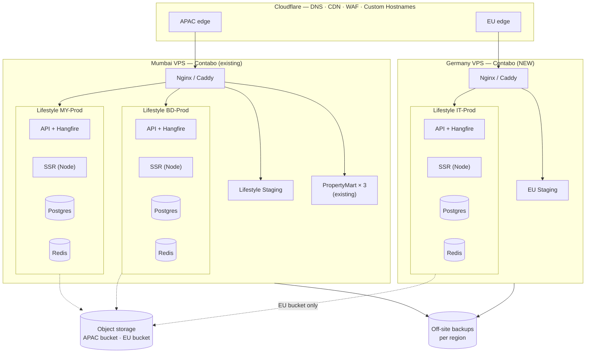

# Infrastructure & Multi-Region Strategy
## Lifestyle — Malaysia · Bangladesh · Italy

| Field | Value |
|---|---|
| Document | 03 — Infrastructure & Multi-Region Strategy |
| Version | 0.1 (Draft) |
| Date | 2026-08-23 |
| Status | Draft — recommendation for decision |
| Baseline | [`infrastructure-mypropertymart/`](infrastructure-mypropertymart/) v5.0 (Apr 2026) |
| Related | [00 — Project Plan](00-PROJECT-PLAN.md) · [01 — BRD](01-BRD.md) · [02 — Technical FRD](02-TECHNICAL-FRD.md) |

---

> ## ⚠ Revised — read §0.1 first
>
> This document was first written assuming Italy meant an Italian *market* with many vendors. It does
> not: **Italy is one shop.** And v1 ships **without checkout** — selling happens over WhatsApp
> (Project Plan §6.2). Both facts change the recommendation. §0.1 carries the current position;
> §§4–5 below are retained because the underlying analysis still applies once checkout arrives.

## 0. The question, and the original answer

**Question:** the Mumbai server covers Malaysia and Bangladesh. What about Italy?

**Original answer: Italy needs its own deployment inside the EU.** Add a second VPS in Germany
(~€15/month, same provider, same tooling) and run the Italian deployment there.

Latency is the visible reason — Mumbai to Milan is roughly 110–140 ms of round trip, and an SSR
storefront pays that on every uncached request. But latency alone would be arguable; you could throw
edge caching at it.

**GDPR is the reason that actually decides it.** Serving Italian users from Mumbai means EU personal
data is transferred to India. India has **no EU adequacy decision**, so every transfer needs Article 46
safeguards — Standard Contractual Clauses plus a documented Transfer Impact Assessment, maintained
indefinitely, and defensible to the Garante if they ever ask. Putting the data in the EU makes GDPR
Chapter V simply not apply. It costs €15 a month and removes an entire category of legal risk.

There is a larger finding underneath this question, covered in §7: **Lifestyle will not fit on the
current server the way PropertyMart does.** Disk, not RAM, is the binding constraint — a product
catalogue with images will exhaust the 100 GB NVMe well before the 12 GB of RAM is stressed. Object
storage is a day-one requirement for this project, not a "Phase 4" item.

---

## 0.1 Revised position — Italy is one shop, and v1 has no checkout

Two clarifications changed the answer.

**1. Italy is a single shop, not an Italian market.** One client, with their own customers. Not a
country deployment with its own vendor base. The centre of gravity is Bangladesh; Malaysia second;
Italy is one storefront on the platform.

**2. v1 sells through WhatsApp.** No cart, no checkout, no payment, no stored order records
(Project Plan §6.2). A buyer browses and taps through to a chat with the shop owner.

Together these gut the case for a Phase-1 EU server, because **the GDPR argument was about stored
personal data, and in v1 there barely is any.**

### What the Italian shop's storefront actually holds in v1

| Data | v1 | With checkout (Phase 4) |
|---|---|---|
| Buyer name, phone, address | ✗ — the conversation is in WhatsApp, between buyer and seller | ✔ stored |
| Order records | ✗ — only an anonymous inquiry click | ✔ stored |
| Payment data | ✗ | ✔ (tokenised) |
| Buyer accounts | ✗ (optional feature, off for this shop) | ✔ |
| Server logs / IP addresses | ✔ — personal data under GDPR | ✔ |
| Analytics cookies | Only with consent | Only with consent |

In v1 the platform's Italian personal-data footprint is essentially **server logs and consented
analytics**. The buyer's name, phone number and address go to the seller through WhatsApp — where
Meta is the processor and the seller is the controller, not us.

That is a completely different risk profile from "we hold an EU order database in Mumbai."

### Revised recommendation — staged

| | Trigger | Where Italy runs | Extra cost |
|---|---|---|---|
| **Now — v1** | WhatsApp ordering, no checkout | **Mumbai**, with Cloudflare's Milan edge in front and the data-minimisation measures below | **€0** |
| **Before checkout goes live for the Italian shop** | Phase 4 — the moment we store an EU buyer's name and address | **Small EU VPS** | **~€5–10/mo** |

**And when the EU box is needed, it does not need to be a €15 VPS 20.** That sizing was for a whole
Italian marketplace. One shop needs a fraction of it — a small Contabo VPS (or equivalent) is ample
for one API, one Postgres, one Redis and one SSR process at a single shop's traffic. Size it when you
provision it, not now.

### Data-minimisation measures for v1 (do these, they are cheap)

Because the Italian storefront runs from Mumbai in v1, keep the footprint genuinely small:

1. **Truncate IP addresses in logs** for EU visitors (drop the last octet), or hash them. Set log
   retention to 30 days. This is a Serilog enricher — an hour of work.
2. **No analytics or non-essential cookies before consent.** A compliant consent banner on the Italian
   storefront, per the Garante's guidelines.
3. **Buyer accounts off** for this shop in v1. Nothing to store if nobody registers.
4. **Privacy notice in Italian** stating plainly what is collected, where it is processed, and that
   ordering happens through WhatsApp under Meta's and the seller's own terms.
5. **A short SCC + transfer note** covering the residual log processing. Much lighter than a full
   Transfer Impact Assessment over an order database, but do not skip it entirely — get an EU lawyer
   to confirm the level of documentation proportionate to this footprint.

### The trigger, stated plainly

**The day the Italian shop gets a checkout is the day its data moves to the EU.** Not before, not
after. Put that in the Phase 4 plan as a hard prerequisite, so it cannot be forgotten in the rush to
ship payments — retrofitting a region migration onto a live shop with real orders is far more work
than provisioning the box up front.

### What about latency for one shop?

Mumbai → Milan is still ~110–140 ms, but in v1 it matters much less than it would with a checkout:

- Catalogue and product pages are cacheable at Cloudflare's Milan edge — most page views never reach
  Mumbai.
- There is **no checkout**, which was the flow that suffered most (six sequential uncached calls).
- The seller's own admin use will feel slow. It is one shop owner, and it is a real but tolerable cost.

Cache catalogue pages aggressively at the edge for this storefront and the browsing experience will be
acceptable. Revisit when checkout arrives — which is the same trigger as the GDPR one, conveniently.

---

## 1. Scope note — the three markets

| Market | Role | Scale |
|---|---|---|
| **Bangladesh** | Primary — most sellers and buyers | Many shops |
| **Malaysia** | Secondary | Many shops |
| **Italy** | **One client shop**, serving its own customers | One shop |

Bangladesh and Malaysia are country markets in the PropertyMart sense — one deployment each, same
codebase, different `.env`. **Italy is not a market; it is a tenant.** That distinction is what makes
a dedicated Italian deployment look disproportionate in v1, and what makes a small one sufficient
later.

> **Still worth confirming:** does the Italian shop need to be its *own deployment* (separate database,
> separate domain, isolated), or can it be a vendor on a shared deployment? If EU data residency is the
> only driver, it must be its own deployment once checkout exists — a shared database in Mumbai
> containing one EU shop's orders puts the whole database in scope.

---

## 2. Baseline — what exists today

From `infrastructure-mypropertymart/` v5.0.

| Item | Current |
|---|---|
| Server | Contabo Cloud VPS 20 — 6 vCPU, 12 GB RAM, 100 GB NVMe, **India (Mumbai)**, ~€15/mo |
| Deployments | 3 Docker stacks on one host: BD-Prod (:5100), BD-Staging (:5200), MY-Prod (:5300) |
| Isolation | Independent git clone, `.env`, Docker network and Postgres volume per stack |
| Database | PostgreSQL 17 in Docker, one container per stack, never exposed to the host |
| Edge | Cloudflare (DNS, CDN, DDoS, SSL proxy) → host-level Nginx → container ports |
| TLS | Let's Encrypt via Certbot on Nginx |
| Frontend | Angular **static SPA** on Cloudflare Pages, 3 projects, auto-deploy on push |
| Auth | Firebase Auth (3 projects); the API only verifies tokens |
| Files | Local disk, `/var/data/propertymart/{env}/uploads/`, served directly by Nginx |
| Backups | `pg_dump` cron + weekly file `rsync`, 14/7-day retention, **on the same server's disk** |
| Deploy | Manual SSH: `git pull` + `docker compose up --build --no-deps api` |
| Observability | Serilog files (30 d), Sentry (frontend only), GA4 |
| Utilisation | ~1.55 GB of 12 GB RAM used; ~10.4 GB headroom |

**This is a well-organised setup for what it does.** The per-country stack pattern, the isolated
volumes, the documented runbooks and the honest RAM budget are all good, and the multi-country
strategy — same schema, different `.env` — is exactly the right instinct. Lifestyle should inherit
that pattern rather than invent a new one.

The gaps below are not criticisms of that work; they are the places where an e-commerce platform
holding money is held to a higher bar than a property listing site.

---

## 3. Why Lifestyle is heavier than PropertyMart

Before deciding where to put servers, it matters what has to run on them. Lifestyle needs several
things PropertyMart does not.

| Component | PropertyMart | Lifestyle | Consequence |
|---|---|---|---|
| **Frontend rendering** | Static SPA on Cloudflare Pages (free) | **Angular SSR** — a live Node process | SEO is a hard requirement for vendor storefronts (Plan §2.5). A static SPA cannot deliver it. This adds a server process per deployment and takes the frontend off the free Pages tier |
| **Redis** | None | Required — cache, host→vendor resolution, rate limits, checkout sessions, job locks | New container per deployment |
| **Background jobs** | None | Hangfire — payout runs, SLA sweeps, escrow release, reconciliation | In-process, but raises API memory and makes restarts less casual |
| **Object storage** | Local disk | Product media at catalogue scale | See §7 — this is the binding constraint |
| **Search** | Simple queries | Postgres FTS + trigram, GIN indexes | More RAM and disk for the database |
| **Wildcard + custom domains** | Not needed | `*.{platform}.com` **and** vendor-owned domains with automatic TLS | Changes the edge design — see §6 |
| **Auth** | Firebase | ASP.NET Core Identity with memberships and permissions | See §8.5 |
| **Money** | None | Ledger, escrow, payouts | Raises backup and audit requirements from "good practice" to "non-negotiable" |

The wildcard-and-custom-domain requirement and the SSR requirement are the two that genuinely change
the shape of the infrastructure, not just its size.

---

## 4. The Italy question in detail

### 4.1 Latency

Approximate round-trip times from a Mumbai origin:

| Route | Approx. RTT | Assessment |
|---|---|---|
| Mumbai → Dhaka | ~40–60 ms | Good |
| Mumbai → Kuala Lumpur | ~60–85 ms | Acceptable |
| Mumbai → Milan | **~110–140 ms** | Poor for interactive use |
| Frankfurt → Milan | ~20–30 ms | Good |
| Milan → Milan | ~5–15 ms | Excellent |

> These are indicative. **Measure before committing** — run `mtr` from an Italian vantage point to the
> Contabo IP over a few days. A one-line real measurement beats any table I can write.

What 130 ms actually costs, with Cloudflare already in front:

- **Static assets** — no impact. Served from Cloudflare's Milan edge.
- **Cached catalogue pages** — no impact when they hit the edge cache.
- **Uncached SSR page** — the edge must fetch from Mumbai. TLS terminates locally, so the handshake is
  cheap, but the origin fetch is a full round trip: **TTFB around 150–250 ms before the server does any
  work**. Add render time and you are near the 2.5 s LCP budget (FRD NFR-04) before anything has gone
  wrong.
- **Checkout** — the real problem. A checkout flow makes several sequential authenticated calls
  (session, shipping quote, voucher validation, place order). None can be edge-cached. Six sequential
  calls at 130 ms is **almost a second of pure network**, on the single flow where abandonment costs
  money directly.
- **Seller and admin panels** — every action feels sluggish. Vendors use these all day.

**Conclusion: browsing survives with aggressive caching; checkout and the back offices do not.**

### 4.2 GDPR — the decisive factor

Italy is in the EU, so GDPR applies to the personal data of Italian buyers and vendors — names,
addresses, phone numbers, order history, IP addresses, and vendor KYC documents.

Hosting that data on a server in India is an **international transfer** under GDPR Chapter V.

- **India has no EU adequacy decision.** (Contabo being a German company is irrelevant — what matters
  is where the server physically is.)
- So the transfer needs Article 46 safeguards: **Standard Contractual Clauses**, plus a documented
  **Transfer Impact Assessment** assessing Indian government access laws against EU standards, kept
  current, and defensible if challenged.
- Italy's Garante is among the more active EU data protection authorities.
- Enforcement risk aside, this is a **sales problem**: an Italian client's own legal review will ask
  where the data lives, and "India, but we have SCCs" is a much weaker answer than "Germany."

**Hosting in the EU removes the question entirely.** Chapter V does not apply to a transfer that does
not happen. For €15 a month, this is not a close call.

> This is not legal advice. Have an EU-qualified lawyer confirm the analysis and draft the
> documentation, whichever option you pick.

### 4.3 The rest of the EU compliance surface

Latency and hosting are the easy part. Italy brings obligations that change the **product**, not just
the servers. These are flagged here because they affect infrastructure planning and timelines; they
belong in a proper Italy BRD revision.

| Area | Requirement | Impact |
|---|---|---|
| **Right of withdrawal** | EU consumers have **14 days**, no reason required | BRD §8.6 specifies a 7-day return window. For Italy this is not negotiable and must be configurable per country |
| **Omnibus Directive** | A price reduction must show the **lowest price in the previous 30 days** | Our anti-fake-discount rule (`BR-C-08`) uses a different test. Needs a country-specific implementation |
| **DSA (Digital Services Act)** | Online marketplaces must verify trader identity, ensure trader traceability, provide notice-and-action, and report transparently | Vendor KYC becomes a legal requirement, not a policy choice. New reporting obligations |
| **GPSR (product safety)** | Product safety information and an EU-based responsible person for many goods | New required product fields for the EU deployment |
| **VAT (IVA)** | Standard rate 22% (verify current); consumer prices must display **VAT-inclusive** | The tax engine must support inclusive display, unlike Malaysia's likely exclusive model |
| **E-invoicing (SDI / FatturaPA)** | Italy mandates electronic invoicing through the Sistema di Interscambio | A real integration, comparable in effort to LHDN MyInvois for Malaysia |
| **PSD2 / SCA** | Strong Customer Authentication on payments | Handled by the gateway, but affects checkout flow design |
| **ePrivacy / cookies** | Consent banner meeting the Garante's guidelines | Frontend work on the EU deployment |
| **Payments** | Cards, SEPA, PayPal, Satispay, Bancomat Pay, BNPL (Scalapay/Klarna) | Completely different provider set from Malaysia — Stripe, Adyen or Nexi rather than iPay88/Razer |
| **Couriers** | Poste Italiane, BRT, GLS, SDA, DHL, InPost lockers | Different provider set again |
| **Language** | Italian | Full localisation, not a fast follow |

**This is the honest headline: Italy is not "the same platform in another region."** It is a
materially different compliance and integration surface. The infrastructure answer is €15/month; the
product answer is a phase of work. §9 sizes it.

### 4.4 Bangladesh, since it is "mostly BD"

Mumbai serves Bangladesh well (~40–60 ms), so there is no hosting question. But the same
"different country, different product" point applies:

- **Cash on delivery is dominant in Bangladesh.** The BRD excludes COD from the MVP because it breaks
  the escrow model — a reasonable call for Malaysia, and the wrong call for Bangladesh. COD needs to
  be a supported, country-toggleable payment method with its own settlement path.
- **Payments:** bKash, Nagad, Rocket, and aggregators (SSLCommerz, aamarPay, ShurjoPay). Mobile
  financial services, not card-first.
- **Couriers:** Pathao, Steadfast, RedX, Sundarban, eCourier, Paperfly. Notably, most of these
  **collect COD and remit it**, which changes the ledger design — the courier becomes a party in the
  money flow.
- **Address model:** Division → District → Upazila (already solved in PropertyMart — reuse it).
- **Currency/language:** BDT, Bengali.
- **Regulatory:** Bangladesh Bank rules on payment aggregation and fund settlement; check whether
  holding buyer funds in escrow requires a licence or a partner arrangement.

COD-plus-courier-remittance is the single biggest BD-specific design item, and it touches the ledger —
the most expensive module to change later. It should be designed alongside the ledger in Phase 3, not
discovered afterwards.

---

## 5. Options for Italy

| | **A — Serve from Mumbai** | **B — EU VPS in Germany** ⭐ | **C — VPS in Milan** | **D — Global active-active** |
|---|---|---|---|---|
| Extra cost | €0 | ~€15/mo | ~€20–60/mo | €200+/mo |
| Milan latency | 110–140 ms | 20–30 ms | 5–15 ms | 5–15 ms |
| GDPR transfer | SCCs + TIA required, ongoing | **Not applicable** | **Not applicable** | Complex |
| "Where is our data?" | India | Germany (EU) | Italy | Everywhere |
| Tooling change | None | None — same Contabo, same runbooks | Some, if a hyperscaler | Substantial |
| Ops burden | None | One more server to patch and back up | Same | High |
| Verdict | Pilot/demo only | **Recommended** | If contractually required | Rejected |

> **Superseded for v1 — see §0.1.** With Italy being one shop and v1 having no checkout, the staged
> answer is: Mumbai now (€0), a **small** EU VPS (~€5–10/mo) when checkout arrives. The comparison
> below still governs *which* EU option to pick at that point, and the sizing assumptions in it are
> for a full Italian market — scale them down for one shop.

**Option B is the recommendation once checkout exists.** It removes the GDPR transfer problem outright, brings latency into
a normal range, and costs the same as the existing server. Critically, it changes **nothing** about how
you work — same provider, same Docker stack pattern, same Nginx and Certbot runbooks, same backup
scripts. The existing `setup/02_contabo_server_setup.md` procedure applies almost verbatim.

**Move to Option C if** the Italian client contractually requires data residency in Italy
specifically, or if measured latency to Milan from Germany turns out to hurt conversion. Italian
providers (Aruba, Seeweb) or the Milan regions of AWS/Azure/GCP all work; the trade is cost and, for
hyperscalers, new tooling.

**Option D is rejected.** Active-active across continents means either cross-region write latency or
multi-master conflict resolution, plus GDPR complexity from replicating EU data outward. Nothing in
the requirements justifies it. Country-isolated deployments give better compliance *and* lower
complexity — the rare case where the simpler design is also the more correct one.

---

## 6. Target architecture

Two regions. Each deployment is fully self-contained: its own database, its own Redis, its own media,
its own domain. Nothing is shared across a border.



### 6.1 Deployment map

| Deployment | Region | Country | Domain | Language | Currency |
|---|---|---|---|---|---|
| `my-prod` | Mumbai | Malaysia | `{platform}.com` | EN / BM | MYR |
| `bd-prod` | Mumbai | Bangladesh | `{bd-domain}` | BN / EN | BDT |
| `apac-staging` | Mumbai | — | `stage.{platform}.com` | EN | — |
| `it-prod` | Germany | Italy | `{it-domain}` | IT | EUR |
| `eu-staging` | Germany | — | `stage.{it-domain}` | IT / EN | — |

Same container image everywhere. `DEPLOYMENT_COUNTRY` selects a **country profile** (§8.1). One
codebase, one build, five configurations — the PropertyMart pattern, extended.

### 6.2 The edge: wildcard and custom domains

This is where Lifestyle diverges most from PropertyMart, and it needs a decision.

Lifestyle needs TLS for three classes of hostname:

1. `www.{platform}.com`, `api.…`, `seller.…`, `admin.…` — fixed, trivial.
2. `{slug}.{platform}.com` — **wildcard**, one certificate, unbounded vendors.
3. `xyz.com` — **arbitrary vendor-owned domains**, requiring on-demand issuance (Plan §4.3).

Class 3 is the hard one. Two viable approaches:

**Approach 1 — Caddy at the host, replacing Nginx.** Caddy does on-demand TLS natively: an unknown
hostname arrives, Caddy asks our API "do we know this domain?", and issues a certificate if the answer
is yes. The authorisation callback is essential — without it, it is an open certificate-request relay
and a denial-of-service vector. This is the least moving parts, and it works identically in both
regions.

**Approach 2 — Cloudflare for SaaS (Custom Hostnames).** Purpose-built for exactly this: Cloudflare
terminates TLS for vendor domains at its edge and forwards to the origin. Keeps DDoS protection and
edge caching on vendor domains, which Approach 1 does not. Adds per-hostname cost and an API
integration.

> **Note on wildcards and Cloudflare plans.** Cloudflare's Universal SSL covers one level of subdomain,
> but *proxying* wildcard DNS records has historically required a paid plan. Plan features change —
> **verify current limits on your plan before designing around them.** If proxied wildcards are not
> available, the fallback is a DNS-only (grey-cloud) wildcard record pointing straight at the origin,
> with the origin terminating TLS. That works, but vendor storefronts then lose Cloudflare's caching
> and DDoS protection — which is a meaningful loss, since storefronts are the SEO surface.

**Recommendation: Caddy for launch** (simplest, no per-hostname cost, one mechanism for both wildcard
and custom domains), and evaluate Cloudflare for SaaS once there are enough custom domains for edge
caching on them to matter. Either way, keep the redirect logic in the application as designed in
FRD §5.4, so behaviour is testable and does not depend on which edge is in front.

---

## 7. Capacity — and the constraint that actually bites

### 7.1 RAM

Per Lifestyle production deployment, estimated:

| Component | RAM |
|---|---|
| API (.NET 10 + Hangfire) | 400–600 MB |
| PostgreSQL 17 | 512 MB – 1 GB |
| Redis | 256 MB |
| Angular SSR (Node) | 300–500 MB |
| **Per deployment** | **~1.5–2.4 GB** |

Mumbai VPS 20 (12 GB) projected:

| Workload | RAM |
|---|---|
| OS + Docker + edge | ~300 MB |
| PropertyMart × 3 (measured) | ~1.55 GB |
| Lifestyle MY-Prod | ~2.0 GB |
| Lifestyle BD-Prod | ~2.0 GB |
| Lifestyle APAC-Staging | ~1.5 GB |
| **Total** | **~7.4 GB of 12 GB** |

Workable, with about 4.5 GB of headroom. Tighter than it looks, though — Postgres benefits from far
more cache than the minimum, and an e-commerce workload is more memory-hungry under load than a
listings site. **Budget the VPS 30 upgrade (24 GB) for the launch of the second Lifestyle deployment**
rather than waiting for pressure. The existing resize runbook covers the procedure.

### 7.2 Disk — the real constraint

This is the finding that matters most, and it is not in the current plan.

Target catalogue is 30,000 SKUs (BRD §11). At ~5 images per product and 4 derivatives each
(thumb/card/detail/zoom, per FRD §17), averaging ~150 KB:

```
30,000 × 5 × 4 × 150 KB  ≈  90 GB   — for one deployment's product media
```

The server has **100 GB total**, already hosting three PropertyMart stacks and their uploads.
**One** Lifestyle deployment at target scale exhausts it. Two do not fit at all. This is a hard wall,
and it arrives long before RAM becomes an issue.

**Therefore: object storage is a Phase 1 requirement for Lifestyle, not a future optimisation.** The
FRD already specifies S3-compatible storage with pre-signed direct upload (§17), so the application
design is correct — it just must not be deferred.

Options, in order of preference:

1. **Cloudflare R2** — S3-compatible, **no egress fees** (significant: product images are almost all
   egress), integrates with the Cloudflare you already run, and supports jurisdictional restriction so
   the EU bucket keeps EU data in the EU. Best fit.
2. **Contabo Object Storage** — same provider, S3-compatible, cheap, simple billing.
3. **Backblaze B2** — cheap, S3-compatible, free egress via the Cloudflare partnership.

Self-hosted MinIO on the same VPS is **not** a solution here — it stores the same bytes on the same
constrained disk. MinIO stays useful for local development, which is where the FRD should place it.

> Verify current pricing and the R2 jurisdiction feature directly — object storage pricing changes.

### 7.3 CPU

6 vCPU is adequate for the API workload. The unknowns are SSR rendering (CPU-bound, per uncached
request) and image derivative generation (bursty). Mitigate SSR cost with edge caching on catalogue
pages, and move derivative generation to a queue with limited concurrency so an import cannot starve
request handling.

---

## 8. What the codebase needs for multi-country

The FRD is currently written for Malaysia. These are the changes that make it deployable to three
countries. Most of the necessary abstractions **already exist** — they were designed for provider
swaps and extend naturally to country scoping.

### 8.1 Country profile

`DEPLOYMENT_COUNTRY` (`MY` / `BD` / `IT`) selects a profile that supplies:

| Setting | MY | BD | IT |
|---|---|---|---|
| Currency | MYR | BDT | EUR |
| Locales | `en`, `ms` | `bn`, `en` | `it` |
| Price display | Tax-exclusive *(confirm)* | Tax-exclusive *(confirm)* | **Tax-inclusive (required)** |
| Tax model | SST | VAT ~15% *(verify)* | IVA 22% *(verify)* |
| E-invoicing | LHDN MyInvois | Mushak / VAT challan | **SDI / FatturaPA** |
| Return window | 7 days | TBD | **14 days (mandatory)** |
| Discount-display rule | Genuine-price test | TBD | **Omnibus: lowest price in 30 days** |
| COD | Optional | **Required** | Rare |
| Address model | State + postcode | Division → District → Upazila | Region → Province → Comune + CAP |
| Payments | FPX, cards, e-wallets | bKash, Nagad, SSLCommerz, COD | Cards, SEPA, PayPal, Satispay, BNPL |
| Couriers | J&T, Pos Laju, Ninja Van… | Pathao, Steadfast, RedX… | Poste Italiane, BRT, GLS… |
| Privacy regime | PDPA | BD rules *(verify)* | **GDPR** |
| Marketplace regime | — | — | **DSA + GPSR** |

The profile is data plus a set of registered providers — **not** `if (country == "IT")` scattered
through the code. Country-conditional logic in handlers is how this kind of system rots.

### 8.2 What already fits

- `IPaymentProvider` and `IShippingProvider` (FRD §12.1, §14.1) — extend registration with a country
  scope. The abstraction was right; it just needs a dimension.
- `ShippingCapabilities` — already models providers that cannot do everything. Bangladeshi COD-collecting
  couriers slot in as another capability.
- Per-order tax rate storage (FRD §12.5) — already correct for varying rates.
- Ledger (FRD §13) — currency-aware, provider-agnostic. Sound as designed.

### 8.3 What needs design work

1. **Address model** — currently Malaysia-shaped. Needs a country-parameterised structure with per-country
   validation. PropertyMart already solved BD divisions/districts/upazilas; reuse that data.
2. **COD in the ledger** — money collected by the courier, not the gateway, and remitted later. A new
   account type and settlement path. **Design this with the ledger in Phase 3.**
3. **Tax engine** — inclusive vs exclusive display, per-country rules, per-country invoice formats.
4. **Return window and discount-display rules** — per-country configuration, not constants.
5. **DSA obligations** for the EU deployment — trader verification and traceability, notice-and-action,
   transparency reporting.
6. **Full i18n** — Italian and Bengali are not fast-follows if those markets launch on them. Bengali
   also brings script and font considerations.

### 8.4 One codebase or three?

**One.** Same image, different configuration — the PropertyMart pattern, and it is the right one.
Forking per country produces three divergent codebases and triples the maintenance cost within a year.
The discipline required: country differences live in **configuration and provider registrations**, never
in branching business logic.

### 8.5 A divergence to decide: Firebase Auth vs ASP.NET Core Identity

PropertyMart uses Firebase Auth. The Lifestyle FRD (§4) specifies ASP.NET Core Identity with
memberships, granular permissions, vendor-scoped roles, token audiences per surface, and admin
impersonation.

**Recommendation: stay with Identity for Lifestyle.** The permission and membership model is core to a
multi-vendor marketplace with staff sub-accounts, and Firebase would mean maintaining that model
alongside it anyway. It also keeps EU user data on EU infrastructure — Firebase would put authentication
data in Google's infrastructure, adding another GDPR transfer analysis you do not need.

The cost is that Lifestyle and PropertyMart authenticate differently. That is acceptable — they are
different products with different needs.

---

## 9. Rollout plan

Revised for the WhatsApp-first v1 and the one-shop Italy scope.

| Step | What | When |
|---|---|---|
| 1 | **Fix the backup gap** (§10.1) — off-site copies + an automated restore test | **Immediately**, independent of Lifestyle |
| 2 | Provision object storage; wire media into it from the first Lifestyle sprint | Phase 0–1 |
| 3 | Build the country-profile abstraction | Phase 1 |
| 4 | Deploy **BD-Prod** + APAC-Staging on Mumbai — Bangladesh is the primary market | Phases 1–3 |
| 5 | Apply the Italy **v1 data-minimisation measures** (§0.1) — IP truncation, consent banner, no buyer accounts, Italian privacy notice | Phase 3, before the Italian shop goes live |
| 6 | **v1 launch** — BD + MY + the Italian shop, all on Mumbai, all selling via WhatsApp | ~Week 22 |
| 7 | Add monitoring and automated deploys | Before Phase 4 |
| 8 | Design COD + courier remittance alongside the ledger | Phase 4 — do not defer |
| 9 | Payment gateway applications (BD, MY) | During Phase 2–3, ahead of Phase 4 |
| 10 | **Provision the small EU VPS**; migrate the Italian shop | **Hard prerequisite for giving Italy a checkout** |
| 11 | Italy compliance workstream — GDPR, DSA, GPSR, IVA, SDI, 14-day withdrawal, Omnibus | Before Italy gets checkout; **scope with an EU lawyer first** |
| 12 | VPS 30 upgrade on Mumbai | When the second Lifestyle deployment goes live |

**Sequencing note.** The Italian shop can launch on v1 with the rest, from Mumbai, at near-zero
compliance cost — because v1 stores almost nothing about its customers. Everything expensive about
Italy (§4.3: GDPR in earnest, DSA, GPSR, IVA, SDI, the 14-day withdrawal right, Omnibus pricing) is
triggered by **checkout**, not by the storefront existing. Scope that work with a lawyer before
estimating it, and do it once — not incrementally.

---

## 10. Gaps to close before Lifestyle carries money

These apply to the existing server today, and they matter more once real payments flow through it.

### 10.1 Backups are on the same disk as the data — fix this first

`pg_dump` to `/var/backups/` on the same VPS protects against a bad migration or an accidental
`DROP TABLE`. It protects against **nothing** else: disk failure, host failure, account suspension, or
ransomware take the data and every backup together. The overview doc marks off-site sync as "optional,
future."

For a platform holding order and ledger records, that is the single highest-severity gap here.

**Fix, roughly an hour of work:** `rclone` the nightly dumps to R2 or B2 (encrypted), keep 30 daily and
12 monthly, and — the part people skip — **run an automated weekly restore into a scratch database and
alert if it fails.** A backup that has never been restored is not a backup. The Lifestyle plan already
requires a rehearsed restore before launch (BRD §15.10).

### 10.2 No monitoring or alerting

Sentry covers the frontend; there is nothing watching the backend. No uptime check, no metrics, no
alerts. With one product and manual deploys that is survivable. With five deployments across two
continents processing payments, nobody will notice a stuck payout run or a dead container until a
vendor complains.

**Minimum:** uptime monitoring on every public host (UptimeRobot/BetterStack free tiers), Sentry on the
API, disk/RAM alerts, and the business alerts from FRD §23 — payment success rate, order rate,
outbox lag, certificate expiry.

### 10.3 Manual SSH deploys

Tolerable at three stacks. At five to six across two regions, it becomes a source of drift and mistakes
— and a Mumbai-only operator deploying to Germany at 2 a.m. is exactly when a wrong-directory `docker
compose down -v` happens. Automate before the second region, not after.

### 10.4 Single server per region

No redundancy. A Contabo host failure is a full outage until a restore completes. Against the 99.5%
availability target (BRD §13) that is a real gap, though an accepted one at this budget — it is the
reason §10.1 matters so much. Revisit when revenue justifies a standby.

### 10.5 Staging coverage

There is BD-Staging, but no MY or EU staging. Lifestyle needs staging per **region** (payment and
courier sandboxes are region-specific and cannot be tested from the wrong side of the world).

---

## 11. Cost

| Item | Monthly | Notes |
|---|---|---|
| Mumbai VPS 20 | €15 | Existing, shared with PropertyMart |
| Mumbai VPS 30 upgrade | +€15–25 | When the second Lifestyle deployment launches |
| **EU VPS (Italy)** | **€0 for v1; ~€5–10 when checkout arrives** | Revised (§0.1) — one shop, not a market. Not needed until Italy has a checkout |
| Object storage | ~$5–20 | Scales with catalogue; R2 has no egress fees |
| Off-site backup storage | ~$2–5 | Small |
| Cloudflare | €0 | Free tier, unless proxied wildcards or Cloudflare for SaaS are needed |
| Monitoring | €0 | Free tiers initially |
| Email/SMS | Variable | Per country; SendGrid free tier will not survive marketplace volume |
| **Baseline total** | **~€40–60/mo** | Both regions, before payment gateway fees |

Infrastructure is not where this project's cost lives. Payment gateway fees, courier costs and the
Italy compliance workstream will each dwarf it — which is itself a reason not to economise on the
€15 EU server.

---

## 12. Recommendations

1. **Italy stays on Mumbai for v1; move it to a small EU VPS when checkout arrives** (§0.1). One shop
   with no checkout holds almost no EU personal data, so the GDPR case does not justify a server yet.
   Apply the v1 data-minimisation measures, and make "EU region provisioned" a hard prerequisite in
   the Phase 4 plan.
2. **Fix the backup gap on the existing server this week** — off-site copies plus an automated restore
   test. Independent of everything else here.
3. **Adopt object storage from Phase 1.** Disk, not RAM, is the binding constraint, and one Lifestyle
   deployment at target catalogue size exhausts the current 100 GB.
4. **Keep one codebase with country profiles.** Extend the existing provider abstractions with a
   country scope; never branch business logic on country.
5. **Sequence Italy last, and scope it with an EU lawyer before estimating it.** The server is a
   €15 decision; GDPR, DSA, GPSR, IVA, SDI, the 14-day withdrawal right and Omnibus pricing rules are a
   phase of work.
6. **Design COD and courier remittance alongside the ledger in Phase 3.** Bangladesh is the largest
   market by your own description, COD is dominant there, and the ledger is the most expensive module
   to retrofit.
7. **Revise the BRD and FRD for multi-country.** Both currently assume Malaysia. See §13.
8. **Add monitoring and automated deploys before the second region goes live.**

---

## 13. Consequences for the existing documents

The BRD and Technical FRD were written for a Malaysia-only marketplace. Multi-country changes them
materially. Sections needing revision:

| Doc | Section | Change |
|---|---|---|
| BRD | §6.3 Assumptions | "All prices in MYR, all buyers ship to Malaysian addresses" is no longer true |
| BRD | §6 Scope | Add per-country scope; distinguish platform features from country features |
| BRD | §8.6 Returns | Return window becomes country-configurable; 14 days for the EU |
| BRD | §9 Business rules | Money, tax and discount-display rules become country-scoped |
| BRD | §11 Payments | Add BD and IT provider sets; **reconsider the COD exclusion for Bangladesh** |
| BRD | §12 Compliance | Add GDPR, DSA, GPSR, IVA/SDI, and Bangladesh regulation |
| BRD | §13 NFRs | Per-region availability and latency targets |
| FRD | §3.1 EF conventions | Multi-currency; per-country address model |
| FRD | §12 Payments | Country-scoped provider registry; COD settlement path |
| FRD | §13 Ledger | COD and courier remittance accounts |
| FRD | §14 Shipping | Country-scoped courier providers |
| FRD | §17 Media | Object storage from Phase 1; MinIO for local development only |
| FRD | §20 Frontend | Locale set per deployment; Bengali script and font handling |
| FRD | §27 Deploy | Replace the placeholder with the real two-region topology |
| Plan | §6 Roadmap | Add BD and IT deployment phases; re-baseline the timeline |

Say the word and I will make these revisions.

---

## 14. Open questions

| # | Question | Blocks |
|---|---|---|
| 1 | ~~"Clients" — markets or operators?~~ **Answered:** BD and MY are markets, Italy is one shop (§1) | — |
| 1b | Does the Italian shop need its **own deployment**, or can it be a vendor on a shared one? (§1) | EU migration design at Phase 4 |
| 2 | When Italy does need the EU: Germany or Milan? Does the client require Italian residency? | Phase 4 provisioning |
| 3 | Launch order across BD / MY / IT for v1? | Roadmap sequencing |
| 4 | Will the Italian shop ever get a checkout, or stay on WhatsApp indefinitely? | Whether the EU compliance workstream is ever triggered at all |
| 5 | Domains per country — one domain with country subdomains, or separate domains? | DNS, certificates, SEO, branding |
| 6 | Who administers the servers, and can they cover EU business hours? | Ops model, on-call |
| 7 | Does anything need to be shared across countries (vendors selling in two markets, unified admin)? | Whether isolated deployments remain viable |
| 8 | Budget ceiling for infrastructure? | VPS sizing, storage, managed-service choices |
| 9 | Is there an EU legal advisor engaged? | Italy scoping — question 4 depends on this |
